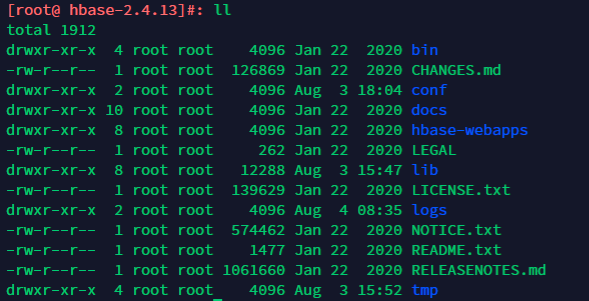
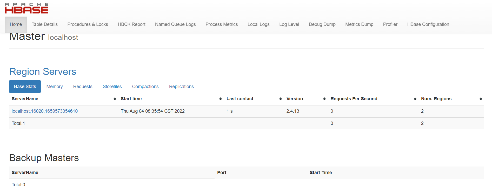
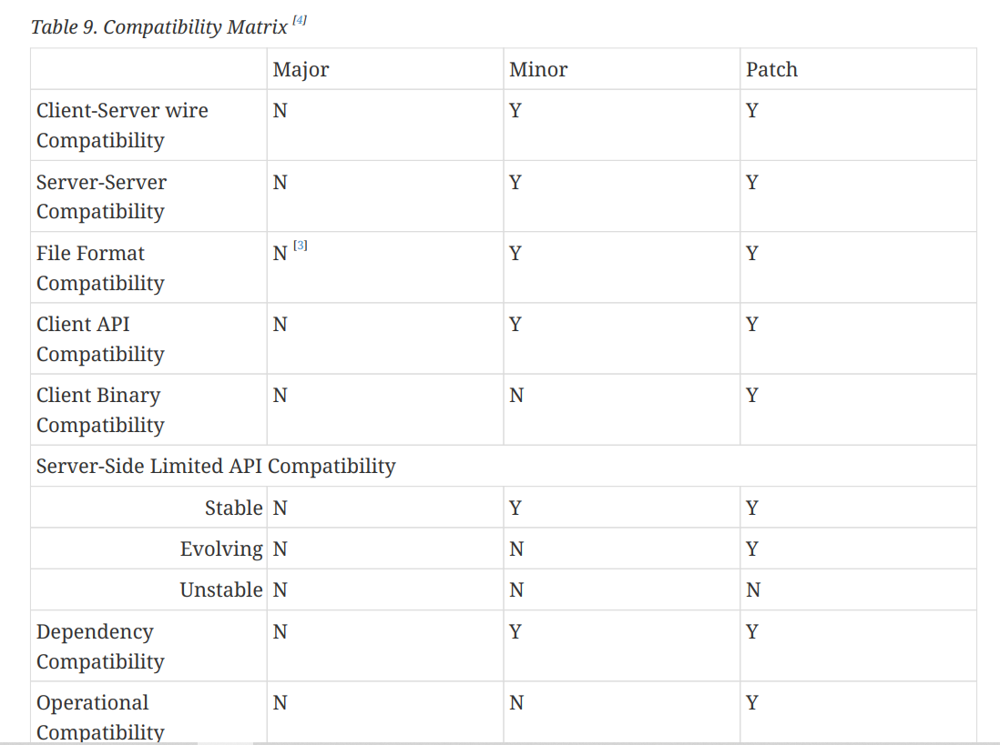
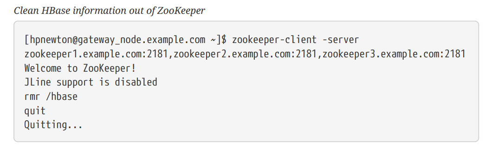
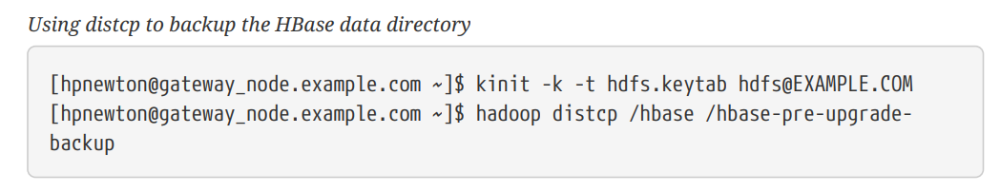
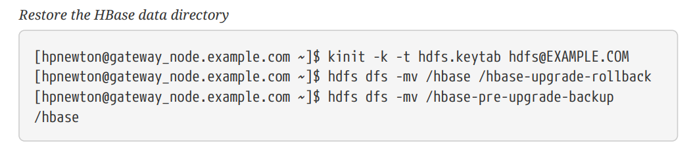
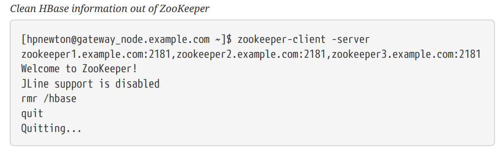
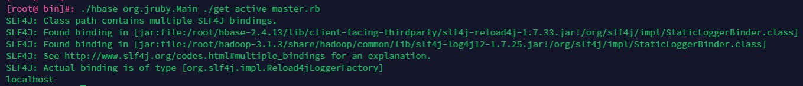

官方文档：https://hbase.apache.org/apache_hbase_reference_guide.pdf

### 一、hbase安装

#### 1、下载安装启动

https://hbase.apache.org/downloads.html。下载后解压，我这里下载的2.4.13版本。



启动hbase前，首先要保证jdk已安装并且版本不低于1.8。

设置jdk的路径

```shell
[root@ hbase-2.4.13]#: cat conf/hbase-env.sh

export JAVA_HOME=/root/jdk1.8.0_212
```

单机模式启动，HMaster，HRegionServer，Zookeeper都运行在一个JVM进程中。

```shell
[root@ hbase-2.4.13]#: ./bin/start-hbase.sh
```

启动后，访问http://ip:16010 就能访问hbase web ui。



停止hbase

```shell
[root@ hbase-2.4.13]#: ./bin/stop-hbase.sh
```

#### 2、命令行启动

可以在hbase shell中操作hbase

```shell
[root@ hbase-2.4.13]#: ./bin/hbase shell
hbase:001:0>help
```

#### 3、伪分布式启动hbase

单机模式里，HMaster，HRegionServer，Zookeeper都运行在一个JVM进程中，伪分布式集群下，虽然还是只有一台机器，但是HMaster，HRegionServer，Zookeeper运行在不同的进程中。

默认情况下，hbase的数据存储在本地的文件系统/tmp中，这里可以配置存储在hdfs中。

参考链接：https://hadoop.apache.org/docs/stable/hadoop-project-dist/hadoop-common/SingleCluster.html#Pseudo-Distributed_Operation。配置伪分布式的hdfs。

启动hdfs后，查看进程

```shell
[root@ ~]#: jps
10691 SecondaryNameNode
10342 NameNode
21959 Jps
10472 DataNode
```

停止hbase，修改hbase的配置`hbase-site.xml`，先删除原来的配置项`hbase.tmp.dir`和`hbase.unsafe.stream.capability.enforce`

```shell
<property>
    <name>hbase.cluster.distributed</name>
    <value>true</value>
</property>
<property>
    <name>hbase.rootdir</name>
    <value>hdfs://localhost:9000/hbase</value>
</property>
```

接着启动hbase，查看进程

```shell
[root@ hbase-2.4.13]#: jps
21671 Jps
20407 HRegionServer
20279 HMaster
20108 HQuorumPeer
```

查看hdfs中是否存在hbase文件夹

```shell
[root@ hadoop-3.1.3]#: ./bin/hadoop fs -ls /hbase
Found 12 items
drwxr-xr-x   - root supergroup          0 2022-08-03 18:05 /hbase/.hbck
drwxr-xr-x   - root supergroup          0 2022-08-04 08:36 /hbase/.tmp
drwxr-xr-x   - root supergroup          0 2022-08-03 18:05 /hbase/MasterData
drwxr-xr-x   - root supergroup          0 2022-08-04 08:36 /hbase/WALs
drwxr-xr-x   - root supergroup          0 2022-08-03 18:05 /hbase/archive
drwxr-xr-x   - root supergroup          0 2022-08-03 18:05 /hbase/corrupt
drwxr-xr-x   - root supergroup          0 2022-08-04 08:36 /hbase/data
-rw-r--r--   1 root supergroup         42 2022-08-03 18:05 /hbase/hbase.id
-rw-r--r--   1 root supergroup          7 2022-08-03 18:05 /hbase/hbase.version
drwxr-xr-x   - root supergroup          0 2022-08-03 18:05 /hbase/mobdir
drwxr-xr-x   - root supergroup          0 2022-08-04 09:51 /hbase/oldWALs
drwx--x--x   - root supergroup          0 2022-08-03 18:05 /hbase/staging
```

### 二、hbase配置

#### 1、配置文件

所有的配置文件都在`/conf`目录下。

> **backup-masters**

不是默认的配置文件，需要手动添加该文件。

当机器上的master需要运行一个备份的master进程时，将机器名称配置在该**文本文件**中，一行配置一个名称。

> **hadoop-metrics2-hbase.properties**

默认的配置文件，默认使用该文件中注释的配置。

该配置文件用于连接HBase Hadoop的Metrics2框架。

> **hbase-env.cmd and hbase-env.sh**

windows环境使用cmd文件，Linux环境使用sh文件。该文件中包含一些注释配置用于参考。

用于配置HBase运行环境，比如JDK的路径、JVM参数、以及其他一些环境变量。

> **hbase-policy.xml**

RPC服务器用于对客户端请求做出授权决策的默认策略配置文件。仅在启用HBase安全性时使用。

> **hbase-site.xml**

HBase核心配置文件。该文件中的配置项会覆盖`hbase-common/src/main/resources/hbase-default.xml `文件中的配置，否则默认使用`hbase-default.xml`文件中的配置。

> **log4j2.xml**

HBase日志配置。

> **regionservers**

文本格式的配置文件。配置集群中哪些机器运行RegionServer。默认情况下，该配置文件包含一个值`localhost`。

它应该包含一个主机名或IP地址列表，每行一个，并且如果集群中的每个节点都将在其localhost接口上运行RegionServer，那么它应该只包含localhost。

***

**记住每次修改配置文件后，都要把修改后的文件同步到集群的所有机器中。**

#### 2、示例配置

搭建一个10节点的HBase分布式集群。节点名称分别为example0，example1，example2。。。example9。HBase的master节点和HDFS的NameNode节点安装在example0机器上。RegionServers安装在example1到example9机器上，Zookeeper安装在example1，example2和example3机器上，端口为2181，持久化目录为`/export/zookeeper.`

主要涉及到的配置文件为`conf/hbase-site.xml`，`conf/hbase-env.sh`，`conf/regionservers`，均在hbase目录下。

> hbase-site.xml

```xml
<?xml version="1.0"?>
<?xml-stylesheet type="text/xsl" href="configuration.xsl"?>
<configuration>
  <property>
      <name>hbase.zookeeper.quorum</name>
      <value>example1,example2,example3</value>
      <description>The directory shared by RegionServers.</description>
  </property>
  <property>
      <name>hbase.zookeeper.property.dataDir</name>
      <value>/export/zookeeper</value>
      <description>Property from ZooKeeper config zoo.cfg.
      The directory where the snapshot is stored.
      </description>
  </property>
  <property>
      <name>hbase.rootdir</name>
      <value>hdfs://example0:8020/hbase</value>
      <description>The directory shared by RegionServers.
      </description>
  </property>
  <property>
      <name>hbase.cluster.distributed</name>
      <value>true</value>
      <description>The mode the cluster will be in. Possible values are
      false: standalone and pseudo-distributed setups with managed ZooKeeper
      true: fully-distributed with unmanaged ZooKeeper Quorum (see hbase-env.sh)
      </description>
  </property>
</configuration>
```

> regionservers

```
example1
example2
example3
example4
example5
example6
example7
example8
example9
```

> hbase-env.sh

```shell
# The java implementation to use.
export JAVA_HOME=/usr/java/jdk1.8.0/
# The maximum amount of heap to use. Default is left to JVM default.
export HBASE_HEAPSIZE=4G
```

使用` rsync`命令将`/conf`目录分发到集群所有的节点。

#### 3、一些重要的配置

分为**必要配置**和**建议配置**两部分。

##### 3.1 必要配置

（1）JDK**路径**

在`hbase-evn.sh`中配置。

（2）**SSH**

配置ssh密钥，让集群中的机器能够无密码互相访问。

（3）**DNS**

配置机器的域名，集群中每台机器`/etc/hosts`中配置集群中所有机器的域名。

（4）**NTP**

集群时间同步。

（5）**ulimit配置**

文件和进程数量限制。HBase可能需要同时打开很多文件，一般Linux系统单个用户能同时打开的文件数量是1024，可以使用`ulimit -n`命令查看当前用户的配置数量。

修改`/etc/security/limits.conf`文件进行配置。

（6）**dfs.datanode.max.transfer.threads**

hadoop目录下，`conf/hdfs-site.xml`文件，至少要4096。（hdfs-default.xml中默认为4096）

```xml
<property>
  <name>dfs.datanode.max.transfer.threads</name>
  <value>4096</value>
</property>
```

配置后重启HDFS。

没有这个配置可能会出现下面的错误

```
10/12/08 20:10:31 INFO hdfs.DFSClient: Could not obtain block
  blk_XXXXXXXXXXXXXXXXXXXXXX_YYYYYYYY from any node: java.io.IOException: No
live nodes
  contain current block. Will get new block locations from namenode and retry
...
```

（7）**大集群配置**

如果集群有很多的regions，在master启动后，一个Regionserver短暂的进入而其他Regionserver还没有进入，那么所有的regions都会分配给第一个Regionserver。

可以通过增大`hbase.master.wait.on.regionservers.mintostart`的值来避免这种情况。（默认为1）

https://issues.apache.org/jira/browse/HBASE-6389

##### 3.2 建议配置

（1）**zookeeper.session.timeout**

默认值90000ms = 90s。意味着如果服务器崩溃，那么主节点需要90s后才能发现该服务器崩溃了并且进行重启。可以把值设置成1min或者更小，这样主节点就能更快重启失败的节点。该配置在`hbase-site.xml`文件中，修改后需要重启。

（2）**zookeeper实例个数**

一个分布式运行的HBase依赖一个zookeeper集群。所有的节点和客户端都必须能够访问zookeeper。默认的情况下HBase会管理一个zookeep集群。这个集群会随着HBase的启动而启动。当然，你也可以自己管理一个zookeeper集群，但需要配置HBase。你需要修改`conf/hbase-env.sh`里面的`HBASE_MANAGES_ZK` 来切换。这个值默认是true的，作用是让HBase启动的时候同时也启动zookeeper。

当HBase管理zookeeper的时候，你可以通过修改`zoo.cfg`来配置zookeeper，一个更加简单的方法是在 `conf/hbase-site.xml`里面修改zookeeper的配置。Zookeep的配置是作为property写在 `hbase-site.xml`里面的。option的名字是 `hbase.zookeeper.property`。

打个比方， `clientPort` 配置在xml里面的名字是 `hbase.zookeeper.property.clientPort`。所有的默认值都是HBase决定的，包括zookeeper。

对于zookeepr的配置，你至少要在 `hbase-site.xml`中列出zookeepr的ensemble servers，具体的字段是 `hbase.zookeeper.quorum`。该这个字段的默认值是 `localhost`，这个值对于分布式应用显然是不可以的. (远程连接无法使用)

（3）**dfs.datanode.failed.volumes.tolerated**

配置磁盘卷可以失败的数量，当达到该数量时，DataNode停止服务。`hdfs-default.xml`文件，默认值为0。

（4）**hbase.regionserver.handler.count**

这个设置决定了处理用户请求的线程数量。默认是10，这个值设的比较小，主要是为了预防用户用一个比较大的写缓冲，然后还有很多客户端并发，这样region servers会垮掉。有经验的做法是，当请求内容很大(上MB，如大puts, 使用缓存的scans)的时候，把这个值放低。请求内容较小的时候(gets, 小puts, ICVs, deletes)，把这个值放大。

当客户端的请求内容很小的时候，把这个值设置的和最大客户端数量一样是很安全的。一个典型的例子就是一个给网站服务的集群，put操作一般不会缓冲,绝大多数的操作是get操作。

把这个值放大的危险之处在于，把所有的Put操作缓冲意味着对内存有很大的压力，甚至会导致OutOfMemory。一个运行在内存不足的机器的RegionServer会频繁的触发GC操作，渐渐就能感受到停顿。(因为所有请求内容所占用的内存不管GC执行几遍也是不能回收的)。一段时间后，集群也会受到影响，因为所有的指向这个region的请求都会变慢。这样就会拖累集群，加剧了这个问题。

（5）**配置大内存机器**

TODO

（6）**压缩**

启用ColumnFamily压缩，有好几个选项，通过降低存储文件大小以降低IO，降低消耗且大多情况下提高性能。具体看文档。

（7）**配置WAL文件的大小和数量**

当RegionServer失败的时候，HBase使用WAL（Write Ahead Log）恢复那些还没有被写入磁盘的数据。这些WAL文件的大小应该比HDFS块小一点（比如HDFS Block大小为128M，那么WAL文件大小120M）。

HBase对WAL的文件数量同样有限制，这样是为了确保在恢复期间不会有太多数据需要重放。数量限制和memstore配置有关，比如RegionServer内存大小为16G，默认的memstore配置为0.4，默认的WAL文件大小为60M，则WAL文件数量为16Gb*0.4/60 = 109

（8）**管理Splitting**

具体看文档。

（9）**管理Compactions**

HBase Compaction分为两种：Minor Compaction 与 Major Compaction，通常我们简称为小合并、大合并。

[深入理解 HBase Compaction 机制](https://cloud.tencent.com/developer/article/1488439)

HBase是基于一种LSM-Tree（Log-Structured Merge Tree）存储模型设计的，写入路径上是先写入WAL（Write-Ahead-Log）即预写日志，再写入memstore缓存，满足一定条件后执行flush操作将缓存数据刷写到磁盘，生成一个HFile数据文件。随着数据不断写入，磁盘HFile文件就会越来越多，文件太多会影响HBase查询性能，主要体现在查询数据的io次数增加。为了优化查询性能，HBase会合并小的HFile以减少文件数量，这种合并HFile的操作称为Compaction，这也是为什么要进行Compaction的原因。

默认情况下，7天会执行一次Major Compaction。

##### 3.3 其他配置

（1）**负载均衡**

负载均衡器(LoadBalancer)是在主服务器上运行的定期操作，以重新分布集群区域。通过hbase.balancer.period 设置，缺省值300000 (5 分钟).

（2）**禁用块缓存**

不建议关闭块缓存（通过hbase.block.cache.size 为 0 来设置）。当前如果关闭块缓存会很不好，因为区域服务器会花很多时间不停加载hfile指数。如果工作集如此配置块缓存没有好处，最少应保证hfile指数保存在块缓存内的大小(可以通过查询区域服务器的UI，得到大致的数值。可以看到网页的上方有块指数值统计)

（3）**[Nagle算法](http://en.wikipedia.org/wiki/Nagle's_algorithm) 或小包问题**

如果操作HBase时看到大量40ms左右的偶然延时，尝试Nagles配置。

（4）**Better Mean Time to Recover (MTTR)**

本节是关于使服务器在故障后更快恢复的配置。

在装有RegionServer的机器上

```xml
<property>
  <name>hbase.lease.recovery.dfs.timeout</name>
  <value>23000</value>
  <description>How much time we allow elapse between calls to recover lease.
  Should be larger than the dfs timeout.</description>
</property>
<property>
  <name>dfs.client.socket-timeout</name>
  <value>10000</value>
  <description>Down the DFS timeout from 60 to 10 seconds.</description>
</property>
```

在装有NameNode/DataNode机器

```xml
<property>
  <name>dfs.client.socket-timeout</name>
  <value>10000</value>
  <description>Down the DFS timeout from 60 to 10 seconds.</description>
</property>
<property>
  <name>dfs.datanode.socket.write.timeout</name>
  <value>10000</value>
  <description>Down the DFS timeout from 8 * 60 to 10 seconds.</description>
</property>
<property>
  <name>ipc.client.connect.timeout</name>
  <value>3000</value>
  <description>Down from 60 seconds to 3.</description>
</property>
<property>
  <name>ipc.client.connect.max.retries.on.timeouts</name>
  <value>2</value>
  <description>Down from 45 seconds to 3 (2 == 3 retries).</description>
</property>
<property>
  <name>dfs.namenode.avoid.read.stale.datanode</name>
  <value>true</value>
  <description>Enable stale state in hdfs</description>
</property>
<property>
  <name>dfs.namenode.stale.datanode.interval</name>
  <value>20000</value>
  <description>Down from default 30 seconds</description>
</property>
<property>
  <name>dfs.namenode.avoid.write.stale.datanode</name>
  <value>true</value>
  <description>Enable stale state in hdfs</description>
</property>
```

#### 4、动态配置

有些配置在修改后不需要重启服务即可生效。具体的动态配置项可以参考文档。

### 三、版本升级

不能跳过主要版本进行升级。比如要从0.98.x升级到2.x，你必须先从0.98.x升级到1.2.x，再从1.2.x升级到2.x。

#### 1、HBase版本号和兼容性

版本号的命名规则以及各版本间api等方面的兼容性。



#### 2、回滚

##### 2.1 所有服务回滚

（1）停止hbase。

（2）执行HDFS和Zookeeper回滚。

（3）把HBase的版本改成之前的版本。

（4）启动HBase。

（5）验证HBase的内容是否正常 --- 使用HBase shell查看表以及查看表的内容。

##### 2.2 HDFS回滚 & Zookeeper降级后HBase回滚

如果HDFS回滚，Zookeeper降级，那么HBase将会处于不一致的状态，必须确保在操作全部完成后再启动集群。

（1）停止hbase。

（2）执行HDFS回滚，Zookeeper降级。

（3）把HBase的版本改成之前的版本。

（4）清空Zookeeper中HBase相关的信息。注意这一步会删除所有的分区信息，可以查看上面警告章节关于hbase分区的内容。



（5）启动HBase。

（6）验证HBase的内容是否正常 --- 使用HBase shell查看表以及查看表的内容。

##### 2.3 HDFS降级后回滚

> 前提条件

- 降级HDFS的能力。
- 确保集群能够运行MapReduce作业。
- 能够使用HDFS超级用户。
- HDFS中至少有两个HBase数据目录副本的足够空间。

> 升级前的工作

升级之前，需要备份HBase的数据。可以使用`distcp`命令把HDFS的数据复制到另一个HDFS集群。

（1）暂停HBase集群。

（2）使用HDFS超级用户，`distcp`命令把HBase的data目录复制到其他位置。



（3）`distcp`将启动一个mapreduce作业，以分布式方式处理文件复制。检查distcp命令的输出，以确保此作业成功完成。

> 执行回滚

（1）暂停HBase。

（2）执行HDFS降级，Zookeeper降级/回滚。

（3）把HBase的版本改成之前的版本。

（4）以HDFS超级用户的身份恢复HBase数据目录。如果备份数据在另一个集群，则使用`distcp`命令把它复制回当前集群。



（5）清空Zookeeper中HBase相关的信息。注意这一步会删除所有的分区信息，可以查看上面警告章节关于hbase分区的内容。



（6）启动HBase。

（7）验证HBase的内容是否正常 --- 使用HBase shell查看表以及查看表的内容。

### 四、HBase shell

启动HBase shell

```shell
./bin/hbase shell
```

输入`help`后回车可以查看所有命令。注意table、column、row的名字需要使用引号。

参考[这篇文章](https://learnhbase.wordpress.com/2013/03/02/hbase-shell-commands/)，对hbase命令进行了整理。

#### 1、运行ruby脚本

在hbase的bin目录下，有一些`.rb`后缀的文件，那就是ruby脚本，可以在hbase shell中运行

```shell
./bin/hbase org.jruby.Main PATH_TO_SCRIPT
```



#### 2、非交互模式

非交互模式下，会返回命令执行的结果（成功0或者失败非0）。交互模式下，总是返回0。

可以加上参数`-n`或者`---non-interactive`进入非交互模式。

```shell
$ echo "describe 'test1'" | hbase shell -n
# 结果输出到文件
$ echo "describe 'test1'" | hbase shell -n > tmp.log
# 不打印输出结果
$ echo "describe 'test'" | hbase shell -n > /dev/null 2>&1

$ echo "error cmd" | hbase shell > /dev/null 2>&1
$ echo $?
0

$ echo "error cmd" | hbase shell -n > /dev/null 2>&1
$ echo $?
1
```

每个命令执行后有一个返回值存放在一个特殊的环境变量$?，如果不保存的话会被覆盖

```shell
#!/bin/bash
echo "describe 'test'" | ./hbase shell -n > /dev/null 2>&1
status=$?
echo "The status was " $status
if ($status == 0); then
  echo "The command succeeded"
else
  echo "The command may have failed."
fi
return $status
```

#### 3、hbase shell执行文件

可以把命令写在一个文件里，每个命令一行。

```txt
// sample_commands.txt
create 'test', 'cf'
list 'test'
put 'test', 'row1', 'cf:a', 'value1'
put 'test', 'row2', 'cf:b', 'value2'
put 'test', 'row3', 'cf:c', 'value3'
put 'test', 'row4', 'cf:d', 'value4'
scan 'test'
get 'test', 'row1'
disable 'test'
enable 'test'
```

执行

```shell
[root@ hbase-2.4.13]#: ./bin/hbase shell /root/simple_script.txt
```


