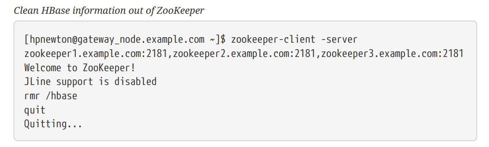
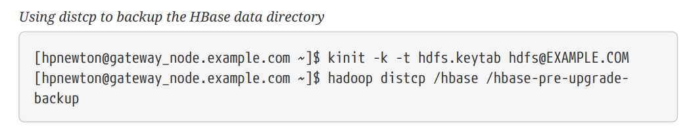
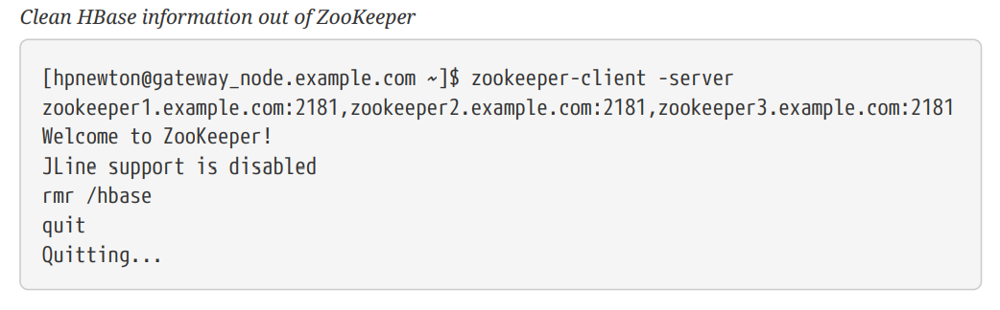

官方文档：https://hbase.apache.org/apache_hbase_reference_guide.pdf

### 一、hbase安装

#### 1、下载安装启动

https://hbase.apache.org/downloads.html。下载后解压，我这里下载的2.4.13版本。


启动hbase前，首先要保证jdk已安装并且版本不低于1.8。

设置jdk的路径

```shell
[root@ hbase-2.4.13]#: cat conf/hbase-env.sh

export JAVA_HOME=/root/jdk1.8.0_212
```

单机模式启动，HMaster，HRegionServer，Zookeeper都运行在一个JVM进程中。

```shell
[root@ hbase-2.4.13]#: ./bin/start-hbase.sh
```

启动后，访问http://ip:16010 就能访问hbase web ui。


停止hbase

```shell
[root@ hbase-2.4.13]#: ./bin/stop-hbase.sh
```

#### 2、命令行启动

可以在hbase shell中操作hbase

```shell
[root@ hbase-2.4.13]#: ./bin/hbase shell
hbase:001:0>help
```

#### 3、伪分布式启动hbase

单机模式里，HMaster，HRegionServer，Zookeeper都运行在一个JVM进程中，伪分布式集群下，虽然还是只有一台机器，但是HMaster，HRegionServer，Zookeeper运行在不同的进程中。

默认情况下，hbase的数据存储在本地的文件系统/tmp中，这里可以配置存储在hdfs中。

参考链接：https://hadoop.apache.org/docs/stable/hadoop-project-dist/hadoop-common/SingleCluster.html#Pseudo-Distributed_Operation。配置伪分布式的hdfs。

启动hdfs后，查看进程

```shell
[root@ ~]#: jps
10691 SecondaryNameNode
10342 NameNode
21959 Jps
10472 DataNode
```

停止hbase，修改hbase的配置`hbase-site.xml`，先删除原来的配置项`hbase.tmp.dir`和`hbase.unsafe.stream.capability.enforce`

```shell
<property>
    <name>hbase.cluster.distributed</name>
    <value>true</value>
</property>
<property>
    <name>hbase.rootdir</name>
    <value>hdfs://localhost:9000/hbase</value>
</property>
```

接着启动hbase，查看进程

```shell
[root@ hbase-2.4.13]#: jps
21671 Jps
20407 HRegionServer
20279 HMaster
20108 HQuorumPeer
```

查看hdfs中是否存在hbase文件夹

```shell
[root@ hadoop-3.1.3]#: ./bin/hadoop fs -ls /hbase
Found 12 items
drwxr-xr-x   - root supergroup          0 2022-08-03 18:05 /hbase/.hbck
drwxr-xr-x   - root supergroup          0 2022-08-04 08:36 /hbase/.tmp
drwxr-xr-x   - root supergroup          0 2022-08-03 18:05 /hbase/MasterData
drwxr-xr-x   - root supergroup          0 2022-08-04 08:36 /hbase/WALs
drwxr-xr-x   - root supergroup          0 2022-08-03 18:05 /hbase/archive
drwxr-xr-x   - root supergroup          0 2022-08-03 18:05 /hbase/corrupt
drwxr-xr-x   - root supergroup          0 2022-08-04 08:36 /hbase/data
-rw-r--r--   1 root supergroup         42 2022-08-03 18:05 /hbase/hbase.id
-rw-r--r--   1 root supergroup          7 2022-08-03 18:05 /hbase/hbase.version
drwxr-xr-x   - root supergroup          0 2022-08-03 18:05 /hbase/mobdir
drwxr-xr-x   - root supergroup          0 2022-08-04 09:51 /hbase/oldWALs
drwx--x--x   - root supergroup          0 2022-08-03 18:05 /hbase/staging
```

### 二、hbase配置

#### 1、配置文件

所有的配置文件都在`/conf`目录下。

> **backup-masters**

不是默认的配置文件，需要手动添加该文件。

当机器上的master需要运行一个备份的master进程时，将机器名称配置在该**文本文件**中，一行配置一个名称。

> **hadoop-metrics2-hbase.properties**

默认的配置文件，默认使用该文件中注释的配置。

该配置文件用于连接HBase Hadoop的Metrics2框架。

> **hbase-env.cmd and hbase-env.sh**

windows环境使用cmd文件，Linux环境使用sh文件。该文件中包含一些注释配置用于参考。

用于配置HBase运行环境，比如JDK的路径、JVM参数、以及其他一些环境变量。

> **hbase-policy.xml**

RPC服务器用于对客户端请求做出授权决策的默认策略配置文件。仅在启用HBase安全性时使用。

> **hbase-site.xml**

HBase核心配置文件。该文件中的配置项会覆盖`hbase-common/src/main/resources/hbase-default.xml `文件中的配置，否则默认使用`hbase-default.xml`文件中的配置。

> **log4j2.xml**

HBase日志配置。

> **regionservers**

文本格式的配置文件。配置集群中哪些机器运行RegionServer。默认情况下，该配置文件包含一个值`localhost`。

它应该包含一个主机名或IP地址列表，每行一个，并且如果集群中的每个节点都将在其localhost接口上运行RegionServer，那么它应该只包含localhost。

***

**记住每次修改配置文件后，都要把修改后的文件同步到集群的所有机器中。**

#### 2、示例配置

搭建一个10节点的HBase分布式集群。节点名称分别为example0，example1，example2。。。example9。HBase的master节点和HDFS的NameNode节点安装在example0机器上。RegionServers安装在example1到example9机器上，Zookeeper安装在example1，example2和example3机器上，端口为2181，持久化目录为`/export/zookeeper.`

主要涉及到的配置文件为`conf/hbase-site.xml`，`conf/hbase-env.sh`，`conf/regionservers`，均在hbase目录下。

> hbase-site.xml

```xml
<?xml version="1.0"?>
<?xml-stylesheet type="text/xsl" href="configuration.xsl"?>
<configuration>
  <property>
      <name>hbase.zookeeper.quorum</name>
      <value>example1,example2,example3</value>
      <description>The directory shared by RegionServers.</description>
  </property>
  <property>
      <name>hbase.zookeeper.property.dataDir</name>
      <value>/export/zookeeper</value>
      <description>Property from ZooKeeper config zoo.cfg.
      The directory where the snapshot is stored.
      </description>
  </property>
  <property>
      <name>hbase.rootdir</name>
      <value>hdfs://example0:8020/hbase</value>
      <description>The directory shared by RegionServers.
      </description>
  </property>
  <property>
      <name>hbase.cluster.distributed</name>
      <value>true</value>
      <description>The mode the cluster will be in. Possible values are
      false: standalone and pseudo-distributed setups with managed ZooKeeper
      true: fully-distributed with unmanaged ZooKeeper Quorum (see hbase-env.sh)
      </description>
  </property>
</configuration>
```

> regionservers

```
example1
example2
example3
example4
example5
example6
example7
example8
example9
```

> hbase-env.sh

```shell
# The java implementation to use.
export JAVA_HOME=/usr/java/jdk1.8.0/
# The maximum amount of heap to use. Default is left to JVM default.
export HBASE_HEAPSIZE=4G
```

使用` rsync`命令将`/conf`目录分发到集群所有的节点。

#### 3、一些重要的配置

分为**必要配置**和**建议配置**两部分。

##### 3.1 必要配置

（1）JDK**路径**

在`hbase-evn.sh`中配置。

（2）**SSH**

配置ssh密钥，让集群中的机器能够无密码互相访问。

（3）**DNS**

配置机器的域名，集群中每台机器`/etc/hosts`中配置集群中所有机器的域名。

（4）**NTP**

集群时间同步。

（5）**ulimit配置**

文件和进程数量限制。HBase可能需要同时打开很多文件，一般Linux系统单个用户能同时打开的文件数量是1024，可以使用`ulimit -n`命令查看当前用户的配置数量。

修改`/etc/security/limits.conf`文件进行配置。

（6）**dfs.datanode.max.transfer.threads**

hadoop目录下，`conf/hdfs-site.xml`文件，至少要4096。（hdfs-default.xml中默认为4096）

```xml
<property>
  <name>dfs.datanode.max.transfer.threads</name>
  <value>4096</value>
</property>
```

配置后重启HDFS。

没有这个配置可能会出现下面的错误

```
10/12/08 20:10:31 INFO hdfs.DFSClient: Could not obtain block
  blk_XXXXXXXXXXXXXXXXXXXXXX_YYYYYYYY from any node: java.io.IOException: No
live nodes
  contain current block. Will get new block locations from namenode and retry
...
```

（7）**大集群配置**

如果集群有很多的regions，在master启动后，一个Regionserver短暂的进入而其他Regionserver还没有进入，那么所有的regions都会分配给第一个Regionserver。

可以通过增大`hbase.master.wait.on.regionservers.mintostart`的值来避免这种情况。（默认为1）

https://issues.apache.org/jira/browse/HBASE-6389

##### 3.2 建议配置

（1）**zookeeper.session.timeout**

默认值90000ms = 90s。意味着如果服务器崩溃，那么主节点需要90s后才能发现该服务器崩溃了并且进行重启。可以把值设置成1min或者更小，这样主节点就能更快重启失败的节点。该配置在`hbase-site.xml`文件中，修改后需要重启。

（2）**zookeeper实例个数**

一个分布式运行的HBase依赖一个zookeeper集群。所有的节点和客户端都必须能够访问zookeeper。默认的情况下HBase会管理一个zookeep集群。这个集群会随着HBase的启动而启动。当然，你也可以自己管理一个zookeeper集群，但需要配置HBase。你需要修改`conf/hbase-env.sh`里面的`HBASE_MANAGES_ZK` 来切换。这个值默认是true的，作用是让HBase启动的时候同时也启动zookeeper。

当HBase管理zookeeper的时候，你可以通过修改`zoo.cfg`来配置zookeeper，一个更加简单的方法是在 `conf/hbase-site.xml`里面修改zookeeper的配置。Zookeep的配置是作为property写在 `hbase-site.xml`里面的。option的名字是 `hbase.zookeeper.property`。

打个比方， `clientPort` 配置在xml里面的名字是 `hbase.zookeeper.property.clientPort`。所有的默认值都是HBase决定的，包括zookeeper。

对于zookeepr的配置，你至少要在 `hbase-site.xml`中列出zookeepr的ensemble servers，具体的字段是 `hbase.zookeeper.quorum`。该这个字段的默认值是 `localhost`，这个值对于分布式应用显然是不可以的. (远程连接无法使用)

（3）**dfs.datanode.failed.volumes.tolerated**

配置磁盘卷可以失败的数量，当达到该数量时，DataNode停止服务。`hdfs-default.xml`文件，默认值为0。

（4）**hbase.regionserver.handler.count**

这个设置决定了处理用户请求的线程数量。默认是10，这个值设的比较小，主要是为了预防用户用一个比较大的写缓冲，然后还有很多客户端并发，这样region servers会垮掉。有经验的做法是，当请求内容很大(上MB，如大puts, 使用缓存的scans)的时候，把这个值放低。请求内容较小的时候(gets, 小puts, ICVs, deletes)，把这个值放大。

当客户端的请求内容很小的时候，把这个值设置的和最大客户端数量一样是很安全的。一个典型的例子就是一个给网站服务的集群，put操作一般不会缓冲,绝大多数的操作是get操作。

把这个值放大的危险之处在于，把所有的Put操作缓冲意味着对内存有很大的压力，甚至会导致OutOfMemory。一个运行在内存不足的机器的RegionServer会频繁的触发GC操作，渐渐就能感受到停顿。(因为所有请求内容所占用的内存不管GC执行几遍也是不能回收的)。一段时间后，集群也会受到影响，因为所有的指向这个region的请求都会变慢。这样就会拖累集群，加剧了这个问题。

（5）**配置大内存机器**

TODO

（6）**压缩**

启用ColumnFamily压缩，有好几个选项，通过降低存储文件大小以降低IO，降低消耗且大多情况下提高性能。具体看文档。

（7）**配置WAL文件的大小和数量**

当RegionServer失败的时候，HBase使用WAL（Write Ahead Log）恢复那些还没有被写入磁盘的数据。这些WAL文件的大小应该比HDFS块小一点（比如HDFS Block大小为128M，那么WAL文件大小120M）。

HBase对WAL的文件数量同样有限制，这样是为了确保在恢复期间不会有太多数据需要重放。数量限制和memstore配置有关，比如RegionServer内存大小为16G，默认的memstore配置为0.4，默认的WAL文件大小为60M，则WAL文件数量为16Gb*0.4/60 = 109

（8）**管理Splitting**

具体看文档。

（9）**管理Compactions**

HBase Compaction分为两种：Minor Compaction 与 Major Compaction，通常我们简称为小合并、大合并。

[深入理解 HBase Compaction 机制](https://cloud.tencent.com/developer/article/1488439)

HBase是基于一种LSM-Tree（Log-Structured Merge Tree）存储模型设计的，写入路径上是先写入WAL（Write-Ahead-Log）即预写日志，再写入memstore缓存，满足一定条件后执行flush操作将缓存数据刷写到磁盘，生成一个HFile数据文件。随着数据不断写入，磁盘HFile文件就会越来越多，文件太多会影响HBase查询性能，主要体现在查询数据的io次数增加。为了优化查询性能，HBase会合并小的HFile以减少文件数量，这种合并HFile的操作称为Compaction，这也是为什么要进行Compaction的原因。

默认情况下，7天会执行一次Major Compaction。

##### 3.3 其他配置

（1）**负载均衡**

负载均衡器(LoadBalancer)是在主服务器上运行的定期操作，以重新分布集群区域。通过hbase.balancer.period 设置，缺省值300000 (5 分钟).

（2）**禁用块缓存**

不建议关闭块缓存（通过hbase.block.cache.size 为 0 来设置）。当前如果关闭块缓存会很不好，因为区域服务器会花很多时间不停加载hfile指数。如果工作集如此配置块缓存没有好处，最少应保证hfile指数保存在块缓存内的大小(可以通过查询区域服务器的UI，得到大致的数值。可以看到网页的上方有块指数值统计)

（3）**[Nagle算法](http://en.wikipedia.org/wiki/Nagle's_algorithm) 或小包问题**

如果操作HBase时看到大量40ms左右的偶然延时，尝试Nagles配置。

（4）**Better Mean Time to Recover (MTTR)**

本节是关于使服务器在故障后更快恢复的配置。

在装有RegionServer的机器上

```xml
<property>
  <name>hbase.lease.recovery.dfs.timeout</name>
  <value>23000</value>
  <description>How much time we allow elapse between calls to recover lease.
  Should be larger than the dfs timeout.</description>
</property>
<property>
  <name>dfs.client.socket-timeout</name>
  <value>10000</value>
  <description>Down the DFS timeout from 60 to 10 seconds.</description>
</property>
```

在装有NameNode/DataNode机器

```xml
<property>
  <name>dfs.client.socket-timeout</name>
  <value>10000</value>
  <description>Down the DFS timeout from 60 to 10 seconds.</description>
</property>
<property>
  <name>dfs.datanode.socket.write.timeout</name>
  <value>10000</value>
  <description>Down the DFS timeout from 8 * 60 to 10 seconds.</description>
</property>
<property>
  <name>ipc.client.connect.timeout</name>
  <value>3000</value>
  <description>Down from 60 seconds to 3.</description>
</property>
<property>
  <name>ipc.client.connect.max.retries.on.timeouts</name>
  <value>2</value>
  <description>Down from 45 seconds to 3 (2 == 3 retries).</description>
</property>
<property>
  <name>dfs.namenode.avoid.read.stale.datanode</name>
  <value>true</value>
  <description>Enable stale state in hdfs</description>
</property>
<property>
  <name>dfs.namenode.stale.datanode.interval</name>
  <value>20000</value>
  <description>Down from default 30 seconds</description>
</property>
<property>
  <name>dfs.namenode.avoid.write.stale.datanode</name>
  <value>true</value>
  <description>Enable stale state in hdfs</description>
</property>
```

#### 4、动态配置

有些配置在修改后不需要重启服务即可生效。具体的动态配置项可以参考文档。

### 三、版本升级

不能跳过主要版本进行升级。比如要从0.98.x升级到2.x，你必须先从0.98.x升级到1.2.x，再从1.2.x升级到2.x。

#### 1、HBase版本号和兼容性

版本号的命名规则以及各版本间api等方面的兼容性。


#### 2、回滚

##### 2.1 所有服务回滚

（1）停止hbase。

（2）执行HDFS和Zookeeper回滚。

（3）把HBase的版本改成之前的版本。

（4）启动HBase。

（5）验证HBase的内容是否正常 --- 使用HBase shell查看表以及查看表的内容。

##### 2.2 HDFS回滚 & Zookeeper降级后HBase回滚

如果HDFS回滚，Zookeeper降级，那么HBase将会处于不一致的状态，必须确保在操作全部完成后再启动集群。

（1）停止hbase。

（2）执行HDFS回滚，Zookeeper降级。

（3）把HBase的版本改成之前的版本。

（4）清空Zookeeper中HBase相关的信息。注意这一步会删除所有的分区信息，可以查看上面警告章节关于hbase分区的内容。



（5）启动HBase。

（6）验证HBase的内容是否正常 --- 使用HBase shell查看表以及查看表的内容。

##### 2.3 HDFS降级后回滚

> 前提条件

- 降级HDFS的能力。
- 确保集群能够运行MapReduce作业。
- 能够使用HDFS超级用户。
- HDFS中至少有两个HBase数据目录副本的足够空间。

> 升级前的工作

升级之前，需要备份HBase的数据。可以使用`distcp`命令把HDFS的数据复制到另一个HDFS集群。

（1）暂停HBase集群。

（2）使用HDFS超级用户，`distcp`命令把HBase的data目录复制到其他位置。



（3）`distcp`将启动一个mapreduce作业，以分布式方式处理文件复制。检查distcp命令的输出，以确保此作业成功完成。

> 执行回滚

（1）暂停HBase。

（2）执行HDFS降级，Zookeeper降级/回滚。

（3）把HBase的版本改成之前的版本。

（4）以HDFS超级用户的身份恢复HBase数据目录。如果备份数据在另一个集群，则使用`distcp`命令把它复制回当前集群。


（5）清空Zookeeper中HBase相关的信息。注意这一步会删除所有的分区信息，可以查看上面警告章节关于hbase分区的内容。



（6）启动HBase。

（7）验证HBase的内容是否正常 --- 使用HBase shell查看表以及查看表的内容。

### 四、HBase shell

启动HBase shell

```shell
./bin/hbase shell
```

输入`help`后回车可以查看所有命令。注意table、column、row的名字需要使用引号。

参考[这篇文章](https://learnhbase.wordpress.com/2013/03/02/hbase-shell-commands/)，对hbase命令进行了整理。

#### 1、运行ruby脚本

在hbase的bin目录下，有一些`.rb`后缀的文件，那就是ruby脚本，可以在hbase shell中运行

```shell
./bin/hbase org.jruby.Main PATH_TO_SCRIPT
```


#### 2、非交互模式

非交互模式下，会返回命令执行的结果（成功0或者失败非0）。交互模式下，总是返回0。

可以加上参数`-n`或者`---non-interactive`进入非交互模式。

```shell
$ echo "describe 'test1'" | hbase shell -n
# 结果输出到文件
$ echo "describe 'test1'" | hbase shell -n > tmp.log
# 不打印输出结果
$ echo "describe 'test'" | hbase shell -n > /dev/null 2>&1

$ echo "error cmd" | hbase shell > /dev/null 2>&1
$ echo $?
0

$ echo "error cmd" | hbase shell -n > /dev/null 2>&1
$ echo $?
1
```

每个命令执行后有一个返回值存放在一个特殊的环境变量$?，如果不保存的话会被覆盖

```shell
#!/bin/bash
echo "describe 'test'" | ./hbase shell -n > /dev/null 2>&1
status=$?
echo "The status was " $status
if ($status == 0); then
  echo "The command succeeded"
else
  echo "The command may have failed."
fi
return $status
```

#### 3、hbase shell执行文件

可以把命令写在一个文件里，每个命令一行。

```txt
// sample_commands.txt
create 'test', 'cf'
list 'test'
put 'test', 'row1', 'cf:a', 'value1'
put 'test', 'row2', 'cf:b', 'value2'
put 'test', 'row3', 'cf:c', 'value3'
put 'test', 'row4', 'cf:d', 'value4'
scan 'test'
get 'test', 'row1'
disable 'test'
enable 'test'
```

执行

```shell
[root@ hbase-2.4.13]#: ./bin/hbase shell /root/simple_script.txt
```

#### 4、传递VM参数

可以使用HBase_Shell_OPTS环境变量将VM选项传递给HBase Shell。可以在环境中设置它，例如编辑~/.bashrc，或者将其设置为启动HBase Shell命令的一部分。下面的示例设置了几个与垃圾回收相关的变量，这些变量只在运行HBase Shell的VM的生存期内使用。该命令应在一行上运行，但为了可读性，它被字符\打断。

```shell
HBASE_SHELL_OPTS="-verbose:gc -XX:+PrintGCApplicationStoppedTime
-XX:+PrintGCDateStamps \
  -XX:+PrintGCDetails -Xloggc:$HBASE_HOME/logs/gc-hbase.log" ./bin/hbase shell
```

#### 5、覆盖配置项

在hbase-2.0.5，hbase-2.1.3，hbase-2.2.0，hbase-1.4.10，hbase-1.5.0，可以在hbase shell中设置或者覆盖`base-*.xml`文件中的配置项。

在key/value中加上前缀`-D`

```shell
$ ./bin/hbase shell
-Dhbase.zookeeper.quorum=ZK0.remote.cluster.example.org,ZK1.remote.cluster.example.org
,ZK2.remote.cluster.example.org -Draining=false
...
hbase(main):001:0> @shell.hbase.configuration.get("hbase.zookeeper.quorum")
=>
"ZK0.remote.cluster.example.org,ZK1.remote.cluster.example.org,ZK2.remote.cluster.exam
ple.org"
hbase(main):002:0> @shell.hbase.configuration.get("raining")
=> "false"
```

#### 6、开启debug模式

方式1:

```shell
hbase(main):007:0> debug
Debug mode is ON

hbase(main):008:0> debug
Debug mode is OFF
```

方式2:

```shell
$ ./bin/hbase shell -d
```

#### 7、表变量

HBase 0.95添加了为表提供jruby样式的面向对象引用的shell命令。以前，作用于表的所有shell命令都有一个过程样式，该样式始终将表的名称作为参数。HBase 0.95引入了将表分配给jruby变量的功能。表引用可用于执行数据读写操作，如放置、扫描和获取，以及管理功能，如禁用、删除和描述表。

比如，之前总是需要指定表名

```shell
hbase(main):000:0> create 't', 'f'
0 row(s) in 1.0970 seconds

hbase(main):001:0> put 't', 'rold', 'f', 'v'
0 row(s) in 0.0080 seconds

hbase(main):002:0> scan 't'
ROW COLUMN+CELL
rold column=f:, timestamp=1378473207660, value=v
1 row(s) in 0.0130 seconds

hbase(main):003:0> describe 't'
DESCRIPTION
ENABLED
't', {NAME => 'f', DATA_BLOCK_ENCODING => 'NONE', BLOOMFILTER => 'ROW', REPLICATION_
true
SCOPE => '0', VERSIONS => '1', COMPRESSION => 'NONE', MIN_VERSIONS => '0', TTL => '2
 147483647', KEEP_DELETED_CELLS => 'false', BLOCKSIZE => '65536', IN_MEMORY => 'false
', BLOCKCACHE => 'true'}
1 row(s) in 1.4430 seconds

hbase(main):004:0> disable 't'
0 row(s) in 14.8700 seconds

hbase(main):005:0> drop 't'
0 row(s) in 23.1670 seconds
```

现在，可以将表分配给一个变量，并在jruby shell代码中使用。

```shell
hbase(main):007 > t = create 't', 'f'
0 row(s) in 1.0970 seconds
=> Hbase::Table - t

hbase(main):008 > t.put 'r', 'f', 'v'
0 row(s) in 0.0640 seconds

hbase(main):009 > t.scan
ROW COLUMN+CELL
r column=f:, timestamp=1331865816290, value=v
1 row(s) in 0.0110 seconds

hbase(main):010:0> t.describe
DESCRIPTION
ENABLED
't', {NAME => 'f', DATA_BLOCK_ENCODING => 'NONE', BLOOMFILTER => 'ROW', REPLICATION_
true
SCOPE => '0', VERSIONS => '1', COMPRESSION => 'NONE', MIN_VERSIONS => '0', TTL => '2
 147483647', KEEP_DELETED_CELLS => 'false', BLOCKSIZE => '65536', IN_MEMORY => 'false
', BLOCKCACHE => 'true'}
1 row(s) in 0.0210 seconds

hbase(main):038:0> t.disable
0 row(s) in 6.2350 seconds

hbase(main):039:0> t.drop
0 row(s) in 0.2340 seconds
```

如果表已经创建，可以使用`get_table`方法把表赋值给一个变量

```shell
hbase(main):011 > create 't','f'
0 row(s) in 1.2500 seconds
=> Hbase::Table - t

hbase(main):012:0> tab = get_table 't'
0 row(s) in 0.0010 seconds
=> Hbase::Table - t

hbase(main):013:0> tab.put 'r1' ,'f', 'v'
0 row(s) in 0.0100 seconds

hbase(main):014:0> tab.scan
ROW COLUMN+CELL
r1 column=f:, timestamp=1378473876949, value=v
1 row(s) in 0.0240 seconds
```

列表功能也得到了扩展，以便它以字符串形式返回表名列表。然后可以使用jruby根据这些名称编写表操作脚本。list_snapshots命令的作用也类似。

```shell
hbase(main):016 > tables = list('t.*')
TABLE
t
1 row(s) in 0.1040 seconds
=> ["t"]

hbase(main):017:0> tables.map { |t| disable t ; drop t}
0 row(s) in 2.2510 seconds
=> [nil]
```

#### 8、irbrc

在home目录下创建一个.irbrc文件，添加自定义命令。有一个有用的命令就是纪录历史命令

```shell
$ more .irbrc
require 'irb/ext/save-history'
IRB.conf[:SAVE_HISTORY] = 100
IRB.conf[:HISTORY_FILE] = "#{ENV['HOME']}/.irb-save-history"
```

如果你不想在执行表达式的时候把结果输出到stderr，比如执行`list`命令的时候返回table列表

```shell
$ echo "IRB.conf[:ECHO] = false" >>~/.irbrc
```

可以查看ruby的文档了解更多.irbrc的相关知识。

#### 9、LOG时间转换

可以将日期'08/08/16 20:56:29'从hbase log 转换成一个 timestamp, 操作如下:

```shell
hbase(main):021:0> import java.text.SimpleDateFormat
hbase(main):022:0> import java.text.ParsePosition
hbase(main):023:0> SimpleDateFormat.new("yy/MM/dd HH:mm:ss").parse("08/08/16 20:56:29
", ParsePosition.new(0)).getTime() => 1218920189000
```

也可以反过来操作

```shell
hbase(main):021:0> import java.util.Date
hbase(main):022:0> Date.new(1218920189000).toString() => "Sat Aug 16 20:56:29 UTC
2008"
```

#### 10、查询配置项

```shell
hbase(main):001:0> @shell.hbase.configuration.get("hbase.rpc.timeout")
=> "60000"
```

在shell中设置一个配置项

```shell
hbase(main):005:0> @shell.hbase.configuration.setInt("hbase.rpc.timeout", 61010)
hbase(main):006:0> @shell.hbase.configuration.get("hbase.rpc.timeout")
=> "61010"
```

#### 11、count命令

`count`命令返回表的行数。使用正确的 CACHE 配置时速度非常快

```shell
hbase> count '<tablename>', CACHE => 1000
```

上述计数一次获取 1000 行。如果一行数据很大，可以把CACHE设置小一点。默认情况下一次获取一行。

#### 12、预拆分表（预分区）

了解预分区，参考[这篇文章](https://www.jianshu.com/p/cb92b61f66fc)

```shell
hbase>create 't1','f',SPLITS => ['10','20','30']
```

上面的命令将会创建4个regions，从hbase ui界面可以看到


也可以把分区信息写到一个文件中，在hbase shell中调用，一个数字占一行

```shell
# splits.txt
10
20
30
```

```shell
hbase>create 't14','f',SPLITS_FILE=>'splits.txt'
```

也可以指定regions的数量和分区算法，可以自定义分区算法

```shell
# create table with four regions based on random bytes keys
hbase>create 't2','f1', { NUMREGIONS => 4 , SPLITALGO => 'UniformSplit' }

# create table with five regions based on hex keys
hbase>create 't3','f1', { NUMREGIONS => 5, SPLITALGO => 'HexStringSplit' }
```

也可以使用ruby脚本

```shell
# generate splits for long (Ruby fixnum) key range from start to end key
hbase(main):070:0> def gen_splits(start_key,end_key,num_regions)
hbase(main):071:1>   results=[]
hbase(main):072:1>   range=end_key-start_key
hbase(main):073:1>   incr=(range/num_regions).floor
hbase(main):074:1>   for i in 1 .. num_regions-1
hbase(main):075:2>     results.push([i*incr+start_key].pack("N"))
hbase(main):076:2>   end
hbase(main):077:1>   return results
hbase(main):078:1> end
hbase(main):079:0>

hbase(main):080:0> splits=gen_splits(1,2000000,10)
=> ["\000\003\r@", "\000\006\032\177", "\000\t'\276", "\000\f4\375", "\000\017B<",
"\000\022O{", "\000\025\\\272", "\000\030i\371", "\000\ew8"]
hbase(main):081:0> create 'test_splits','f',SPLITS=>splits
0 row(s) in 0.2670 seconds
=> Hbase::Table - test_splits
```

注意`truncate`命令删除表后会使用默认选项重新创建表，并且不会使用预分区。

### 五、数据模型

HBase中，数据是存储在表里的，表由行和列构成。这跟关系型数据库的描述很像，但两者并不一样。或许把HBase表理解成一个多维地图比较合适。

HBase数据模型相关的术语：

- **Table**：Hbase表由多行组成。
- **Row**：HBase 中的一行由一个行键和一个或多个列以及与之关联的值组成。行在存储时按行键的字母顺序排序。所以行键的设计很重要，目标是把有关联的行尽量放在一起。比较常见的row key就是网站域名，如果你的row key是网站域名，那么需要把它们反过来存储，比如`org.apache.www`，`org.apache.mail`，`org.apache.jira`。这样的话，所有apache相关的域名在表中就存储在一起。
- **Column**：HBase中的一列由一个列族和一个列限定符组成，它们之间通过`:`分隔。
- **Column Family**：列族通常出于性能原因在物理上共置一组列及其值。每个列族都有一组存储属性，例如它的值是否应该缓存在内存中，它的数据是如何压缩的，或者它的行键是如何编码的，等等。表中的每一行都具有相同的列族，尽管给定的行可能不会在给定的列族中存储任何内容。
- **Column Qualifier**：将列限定符添加到列族以提供给定数据的索引。给定一个列族内容，一个列限定符可能是 content:html，另一个可能是 content:pdf。 尽管列族在表创建时是固定的，但列限定符是可变的
  并且行之间可能有很大差异。
- **Cell**：单元格是行、列族和列限定符的组合，包含一个值和一个时间戳，它表示该值的版本。
- **Timestamp**：时间戳写在每个值旁边，是给定版本值的标识符。 默认情况下，时间戳表示写入数据时 RegionServer 上的时间，但您可以在将数据放入单元格时指定不同的时间戳值。

#### 1、概念视图

你可以通过[Understanding HBase and BigTable](https://dzone.com/articles/understanding-hbase-and-bigtab)这篇文章通俗易懂的理解HBase的数据模型，另外这份pdf对于理解HBase也是不错的：[Introduction to HBase Schema Design](http://0b4af6cdc2f0c5998459-c0245c5c937c5dedcca3f1764ecc9b2f.r43.cf2.rackcdn.com/9353-login1210_khurana.pdf)

阅读不同的观点可能有助于深入了解 HBase 模式设计，链接的文章涵盖与本节中相同的信息。

以下示例是[BigTable](https://research.google/pubs/pub27898/)论文第 2 页上示例的略微修改形式。有一个名为webtable的表，它有两行（com.cnn.www和com.example.www），三个列族（contents，anchor，people）。在这个例子中，对于第一行com.cnn.www，anchor包含两列（anchor:cssnsi.com，anchor:my.look.ca），contents包含一列（contents:html）。此示例包含行键为 com.cnn.www 的行的 5 个版本，以及行键为 com.example.www 的行的一个版本。`contents:html` 列限定符包含给定网站的整个 HTML。`anchor`限定符每个都包含链接到由该行表示的站点的外部站点，以及它在其链接的锚点中使用的文本。`people`列族代表与站点相关的人员。

一个列名是由它的列族前缀和*修饰符(qualifier)*连接而成。例如列*contents:html*是列族 `contents`加冒号(`:`)加 *修饰符* `html`组成的。


此表中看似为空的单元格在 HBase 中不占用空间，或者实际上存在。 这就是使 HBase “稀疏”的原因。 表格视图不是查看 HBase 中数据的唯一可能方式，甚至不是最准确的方式。 以下表示与多维地图相同的信息。 这只是一个用于说明目的的模型，可能并不完全准确。


#### 2、物理视图

尽管在概念视图里，表可以被看成是一个稀疏的行的集合。但在物理上，它是区分列族 存储的。新的columns可以不经过声明直接加入一个列族。


值得注意的是在上面的概念视图中空白cell在物理上是不存储的，因为根本没有必要存储。因此若一个请求为要获取`t8`时间的`contents:html`，他的结果就是空。相似的，若请求为获取`t9`时间的`anchor:my.look.ca`，结果也是空。但是，如果不指明时间，将会返回最新时间的行，每个最新的都会返回。例如，如果请求为获取行键为"com.cnn.www"，没有指明时间戳的话，活动的结果是`t6`下的contents:html，`t9`下的`anchor:cnnsi.com`和`t8`下`anchor:my.look.ca`。

#### 3、NameSpace

命名空间是表的逻辑分组，类似于关系数据库系统中的数据库。 这种抽象为即将推出的多租户相关功能奠定了基础：

- 配额管理 (HBASE-8410) - 限制命名空间可以消耗的资源量（即区域、表）。
- 命名空间安全管理 (HBASE-9206) - 为租户提供另一个级别的安全管理。
- Region server组 (HBASE-6721) - 命名空间/表可以固定到RegionServers的子集上，从而保证粗略的隔离级别。

##### 3.1 命名空间管理

命名空间可以创建、修改、删除。命名空间成员资格在表创建期间通过指定格式的完全限定表名来确定：`<table namespace>:<table qualifier>`。

比如

```shell
#Create a namespace
create_namespace 'my_ns'

#create my_table in my_ns namespace
create 'my_ns:my_table', 'fam'

#drop namespace
drop_namespace 'my_ns'

#alter namespace
alter_namespace 'my_ns', {METHOD => 'set', 'PROPERTY_NAME' => 'PROPERTY_VALUE'}

#list namespace
list_namespace
```

##### 3.2 默认的命名空间

有两个默认的命名空间：

- hbase：系统命名空间，用于存放hbase的内置表。
- default：表如果没有指定命名空间，默认放在default里。

比如

```shell
#namespace=foo and table qualifier=bar
create 'foo:bar', 'fam'

#namespace=default and table qualifier=bar
create 'bar', 'fam'
```

#### 4、表（Table）

表是在schema定义时预先声明的。

#### 5、行（Row）

行键是不可分割的字节数组。行是按字典排序由低到高存储在表中的。一个空的数组是用来标识表空间的起始或者结尾。

#### 6、列族（Column Family）

Apache HBase 中的列是按列族进行分组的，一个列族所有列成员是有着相同的前缀。比如，列*courses:history* 和 *courses:math*都是 列族 *courses*的成员。冒号(:)是列族的分隔符，用来区分前缀和列名。column 前缀必须是可打印的字符，剩下的部分(称为qualify),可以由任意字节数组组成。列族必须在表建立的时候声明。column就不需要了，随时可以新建。

在物理上，一个列族的所有成员在文件系统上都是存储在一起。因为存储优化是在列族级别完成的，所以建议所有列族成员都具有相同的一般访问模式和大小特征。

#### 7、Cells

在hbase中，一个*{row, column, version}* 元组就是一个 `cell`。Cell的内容是不可分割的字节数组。

#### 8、数据模型操作

四个主要的数据模型操作是 Get、Put、Scan 和 Delete。 通过 [Table](https://hbase.apache.org/apidocs/org/apache/hadoop/hbase/client/Table.html) 实例应用操作。

##### 8.1 Get

[Get](http://hbase.apache.org/apidocs/org/apache/hadoop/hbase/client/Get.html) 返回特定行的属性。 Gets 通过 [Table.get](https://hbase.apache.org/apidocs/org/apache/hadoop/hbase/client/Table.html#get-org.apache.hadoop.hbase.client.Get-) 执行。

##### 8.2 Put

[Put](https://hbase.apache.org/apidocs/org/apache/hadoop/hbase/client/Put.html) 要么向表增加新行 (如果key是新的) 或更新行 (如果key已经存在)。 Puts 通过 [Table.put](https://hbase.apache.org/apidocs/org/apache/hadoop/hbase/client/Table.html#put-org.apache.hadoop.hbase.client.Put-) (writeBuffer) 或 [Table.batch](https://hbase.apache.org/apidocs/org/apache/hadoop/hbase/client/Table.html#batch-java.util.List-java.lang.Object:A-) (non-writeBuffer)执行。

##### 8.3 Scans

[Scan](https://hbase.apache.org/apidocs/org/apache/hadoop/hbase/client/Scan.html)允许对指定属性的多行进行迭代。

下面是一个在 HTable 表实例上的示例。 假设表有几行键值为 "row1", "row2", "row3", 还有一些行有键值 "abc1", "abc2", 和 "abc3"。下面的示例展示如何构建一个Scan 实例，以返回"row"为前缀的行。

```java
public static final byte[] CF = "cf".getBytes();
public static final byte[] ATTR = "attr".getBytes();
...
Table table = ... // instantiate a Table instance
Scan scan = new Scan();
scan.addColumn(CF, ATTR);
scan.setStartStopRowForPrefixScan(Bytes.toBytes("row"));
ResultScanner rs = table.getScanner(scan);
try {
  for (Result r = rs.next(); r != null; r = rs.next()) {
  // process result...
  }
} finally {
  rs.close(); // always close the ResultScanner!
}
```

请注意，通常为scan设置过滤规则最简单方法是使用 [InclusiveStopFilter](https://hbase.apache.org/apidocs/org/apache/hadoop/hbase/filter/InclusiveStopFilter.html) 类。

##### 8.4 Delete

[Delete](https://hbase.apache.org/apidocs/org/apache/hadoop/hbase/client/Delete.html)从表中删除一行，删除通过[Table.delete](https://hbase.apache.org/apidocs/org/apache/hadoop/hbase/client/Table.html#delete-org.apache.hadoop.hbase.client.Delete-) 执行。

HBase does not modify data in place, and so deletes are handled by creating new markers called tombstones. These tombstones, along with the dead values, are cleaned up on major compactions.

#### 9、版本

一个 *{row, column, version}* 元组是HBase中的一个单元(`cell`)。但是有可能会有很多的单元的行和列是相同的，可以使用版本来区分不同的单元。

rows和column key是用字节数组表示的，version则是用一个长整型表示。这个long的值使用 `java.util.Date.getTime()` 或者 `System.currentTimeMillis()`产生的。这就意味着他的含义是“当前时间和1970-01-01 UTC的时间差，单位毫秒。”

在HBase中，版本是按倒序排列的，因此当读取这个文件的时候，最先找到的是最近的版本。

在 HBase 中，单元版本的语义存在很多混淆。 尤其是：

- 如果对一个单元格的多次写入具有相同的版本，则只有最后一次写入是可获取的。
- 可以按不递增的版本顺序写入单元格。

##### 9.1 指定版本号存储

列的最大版本数可以在创建表时指定，或者使用alter命令，或者[HColumnDescriptor.DEFAULT_VERSIONS](https://hbase.apache.org/apidocs/org/apache/hadoop/hbase/HColumnDescriptor.html)。在0.96版本之前，默认保存三个版本的历史数据，0.96版本的时候默认值修改为1。

建表时设置

```shell
hbase> create '表名',{NAME='列族名1',VERSIONS=给定一个版本号},{NAME='列族名2',VERSIONS=给定的版本号}
```

alter命令

```shell
hbase> disable 'table'
hbase> alter 'table' , NAME => 'f', VERSION => 1
hbase> enable 'table'
```

可以指定查询几个版本的数据

```shell
scan 'test', { VERSIONS=>3}
scan 'test', { COLUMNS => ['f:t1', 'f:t2'],VERSIONS=>3}
```

同样可以指定每个列族的最小版本数，默认是设置为1，表示禁用该功能。下面的例子表示把列族f1的最小版本号设置为1

```shell
hbase> alter ‘t1′, NAME => ‘f1′, MIN_VERSIONS => 2
```

从0.98.2开始，可以为所有新创建的列指定一个全局的最大版本数，通过设置`hbase-site.xml`文件中的`hbase.column.max.version`。

##### 9.2 版本和HBase操作

在本节中，我们将了解每个核心 HBase 操作的版本维度的行为。

（1）Get/Scan

Gets是在Scans的基础上实现的。下面对于[Get](https://hbase.apache.org/apidocs/org/apache/hadoop/hbase/client/Get.html)的讨论等同于[Scans](https://hbase.apache.org/apidocs/org/apache/hadoop/hbase/client/Scan.html)。

默认情况下，如果你没有指定版本，当你使用get命令的时候，会返回版本最大的单元（该Cell可能是最新写入的，但不能保证）。默认的行为可以通过下面的方式修改：

- 如果想返回不止一个版本，参考[Get.setMaxVersions()](https://hbase.apache.org/apidocs/org/apache/hadoop/hbase/client/Get.html#setMaxVersions--)
- 如果想要返回的版本不只是最近的，参考[Get.setTimeRange()](https://hbase.apache.org/apidocs/org/apache/hadoop/hbase/client/Get.html#setTimeRange-long-long-)

要检索小于或等于给定值的最新版本，从而在某个时间点给出记录的“最新”状态，只需使用从 0 到所需版本的范围并将最大版本设置为 1。

（2）默认Get例子

下面的Get操作会只获得最新的一个版本。

```java
public static final byte[] CF = "cf".getBytes();
public static final byte[] ATTR = "attr".getBytes();
...
Get get = new Get(Bytes.toBytes("row1"));
Result r = table.get(get);
byte[] b = r.getValue(CF, ATTR); // returns current version of value
```

（3）指定版本获取

下面的Get操作会返回最近三个版本

```java
public static final byte[] CF = "cf".getBytes();
public static final byte[] ATTR = "attr".getBytes();
...
Get get = new Get(Bytes.toBytes("row1"));
get.setMaxVersions(3); // will return last 3 versions of row
Result r = table.get(get);
byte[] b = r.getValue(CF, ATTR); // returns current version of value
List<Cell> cells = r.getColumnCells(CF, ATTR); // returns all versions of this column
```

（4）Put操作

一个Put操作会给一个`cell`创建一个版本，默认使用当前时间戳，当然你也可以自己设置时间戳。这就意味着你可以把时间设置在过去或者未来，或者随意使用一个Long值。

要想覆盖一个现有的值，就意味着你的row,column和版本必须完全相等。

下面的例子没有指明版本，则HBase会使用当前时间做为版本

```java
public static final byte[] CF = "cf".getBytes();
public static final byte[] ATTR = "attr".getBytes();
...
Put put = new Put(Bytes.toBytes(row));
put.add(CF, ATTR, Bytes.toBytes( data));
table.put(put);
```

下面的例子指明了版本

```java
public static final byte[] CF = "cf".getBytes();
public static final byte[] ATTR = "attr".getBytes();
...
Put put = new Put( Bytes.toBytes(row));
long explicitTimeInMs = 555; // just an example
put.add(CF, ATTR, explicitTimeInMs, Bytes.toBytes(data));
table.put(put);
```

注意：版本时间戳在 HBase 内部用于诸如生存时间计算之类的事情。 通常最好避免自己设置此时间戳。 最好使用行的单独时间戳属性，或将时间戳作为行键的一部分，或两者兼而有之。

下面的 Put 使用方法 getCellBuilder() 来获取已设置相关 Type 和 Row 的 CellBuilder 实例。

```java
public static final byte[] CF = "cf".getBytes();
public static final byte[] ATTR = "attr".getBytes();
...
Put put = new Put(Bytes.toBytes(row));
put.add(put.getCellBuilder().setQualifier(ATTR)
  .setFamily(CF)
  .setValue(Bytes.toBytes(data))
  .build());
table.put(put);
```

（5）Delete操作

有三种不同类型的内部删除标记：

- Delete: 删除列的指定版本。
- Delete column: 删除列的所有版本。
- Delete family: 删除特定列族所有列。

删除整行时，HBase 将在内部为每个 ColumnFamily 创建一个墓碑（即，不是每个单独的列）。

通过创建墓碑标记删除作品。 例如，假设我们要删除一行。 为此，您可以指定一个版本，否则默认使用 currentTimeMillis。 这意味着是删除版本小于或等于该版本的所有单元格。 HBase 从不就地修改数据，因此删除操作不会立即删除（或标记为已删除）删除条件对应的存储文件。 相反，会写入一个所谓的墓碑，它将掩盖已删除的值。 当 HBase 进行主要压缩时，会处理 tombstones 以实际删除死值，以及 tombstones 本身。 如果您在删除行时指定的版本大于该行中任何值的版本，则可以考虑删除整行。

删除标记会在下一次Major Compaction时从内存中清除，除非为列族设置了`KEEP_DELETED_CELLS`选项。通过设置`hbase-site.xml`文件中的`hbase.hstore.time.to.purge.deletes`属性，可以为删除标记设置过期时间。如果`hbase.hstore.time.to.purge.deletes`没有设置或者设置为0，所有的删除标记包括它们的时间戳都会在下一次Major Compaction的时候从内存中清除。否则，删除标记将会在它们对应的时间戳加上`hbase.hstore.time.to.purge.deletes`属性值所对应时间的下一次Major Compaction时从内存中清除。

##### 9.3 HBase-2.0.0 中的可选新版本和删除行为

在 hbase-2.0.0 中，操作员可以通过将列描述符属性 NEW_VERSION_BEHAVIOR 设置为 true 来指定备用版本和删除处理（设置列描述符属性之前，需要先把表设置为disable状态）。


