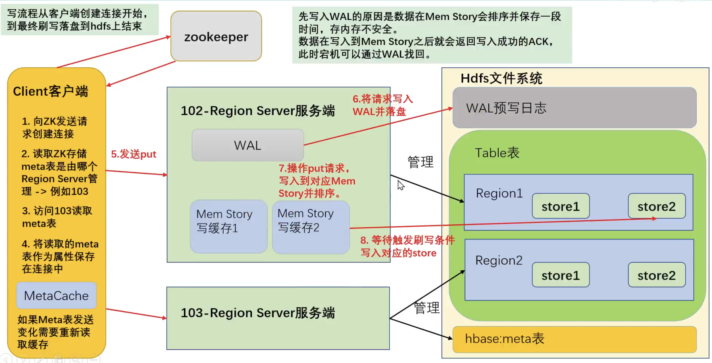

### 一、HBase简介

#### 1.1 HBase定义

根据官网的介绍，[Apache](https://www.apache.org/) HBase™ is the [Hadoop](https://hadoop.apache.org/) database, a distributed, scalable, big data store。Use Apache HBase™ when you need random, realtime read/write access to your Big Data. This project's goal is the hosting of very large tables -- billions of rows X millions of columns -- atop clusters of commodity hardware. 

Apache HBase是以hdfs为数据存储的，一种分布式、可扩展的NoSQL数据库。

#### 1.2 HBase数据模型

HBase的设计理念依据Google的BigTable论文，论文中对于数据模型的首句介绍：**BigTable是一个稀疏的、分布式的、持久的多维排序map**。

之后对于映射的解释如下：该映射由行键、列键和时间戳索引，映射中的每个值都是一个未解释（经过序列化）的字节数组。

最终HBase关于数据模型和BigTable的对应关系如下：HBase使用与BigTable非常相似的数据模型，用户将数据行存储在带标签的表中。数据行具有可排序的键和任意数量的列，该表存储稀疏，因此如果用户喜欢，同一表中的行可以具有疯狂变化的列。

理解HBase数据模型的关键在于**稀疏、分布式、多维、排序**的映射，其中映射map指代非关系型数据库的key-value结构。

##### 1.2.1 HBase逻辑结构

HBase可以用于存储多种结构的数据，以JSON为例，存储的数据原貌为：

```json
{
  "row_key1": {
    "personal_info": {
      "name": "zhangsan",
      "city": "北京",
      "phone": "131********"
    },
    "office_info": {
      "tel": "010-11111111",
      "address": "atguigu"
    }
  },
  "row_key11": {
    "personal_info": {
      "city": "上海",
      "phone": "132********"
    },
    "office_info": {
      "tel": "010-11111111"
    }
  },
  "row_key2": {
    ......
  }
}
```

存储数据稀疏，数据存储多维，不同的行具有不同的列。

数据存储整体有序，按照RowKey的字典序排列，RowKey为Byte数组。


##### 1.2.2 HBase物理存储结构

物理存储结构即为数据映射关系，而在概念视图的空单元格，底层实际根本不存储。


##### 1.2.3 数据模型

（1）NameSpace

命名空间，类似于关系型数据库的database概念，每个命名空间下有多个表。HBase有两个自带的命名空间，分别是hbase和default，hbase中存放的是HBase内置的表，default是用户默认使用的命名空间。

（2）Table

类似于关系型数据库的表概念。不同的是，Hbase定义表时只需要声明列族即可，不需要声明具体的列。因为数据存储是稀疏的，所以往HBase写入数据时，字段可以动态、按需指定。因此，和关系型数据库相比，HBas能够轻松应对字段变更的场景。

（3）Row

HBase表中的每一行数据都由一个RowKey和多个Column（列）组成，数据是按照RowKey的字典顺序存储的，并且查询数据时只能根据RowKey进行检索，所以RowKey的设计十分重要。

（4）Column

Hbase中的每个列都由Column Family（列族）和Column Qualifier（列限定符）进行限定，例如info:name, info:age。建表时，只需要指明列族，而列限定符无需预先定义。

（5）TimeStamp

用于标识数据的不同版本（version），每条数据写入时，系统会自动为其加上该字段，其值为写入HBase的时间。

（6）Cell

由{rowkey, column family:column qualifier, timestamp}唯一确定的单元，cell中的数据全部是字节码形式存储。

#### 1.3 HBase基础架构


架构角色：

（1）Master

实现类为HMaster，负责监控集群中所有的RegionServer实例。主要作用如下：

- 管理元数据表格hbase:meta，接收用户对表格创建修改删除的命令并执行。
- 监控region是否需要进行负载均衡、故障转移和region的拆分。

通过启动多个后台线程监控实现上述功能：

- **LoadBalancer负载均衡器**：周期性监控region分布在regionServer上面是否均衡，由参数hbase.balancer.period控制周期时间，默认5min。
- **CatalogJanitor元数据管理器**：定期检查和清理hbase:meta中的数据。
- **MasterProcWAL master预写日志处理器**：把master需要执行的任务记录在预写日志WAL中，如果master宕机，让backupMaster读取日志继续干。

（2）Region Server

Region Server实现类为HRegionServer，主要作用如下：

- 负责数据cell的处理，例如写入数据put，查询数据get等。
- 拆分合并region的实际执行者，有master监控，有regionServer执行。

（3）zookeeper

HBase通过Zookeeper来做master的高可用，记录RegionServer的部署信息，并且存储有meta表的位置信息。

HBase对于数据的读写操作时直接访问Zookeeper，在2.3版本推出Master Registry模式，客户端可以直接访问master。使用此功能，会加大master的压力，减轻对zookeeper的压力。

（4）HDFS

HDFS为HBase提供最终的底层数据存储服务，同时为HBase提供高容错的支持。

### 二、HBase快速入门

#### 2.1 HBase安装部署

使用三台机器进行安装部署，分别为hadoop1，hadoop2，hadoop3。

##### 2.1.1 Zookeeper部署

按照官方文档在三台机器安装zookeeper并启动。

##### 2.1.2 Hadoop部署

按照官方文档在三台机器安装hadoop并启动。

##### 2.1.3 HBase安装

将HBase解压到指定目录，配置环境变量

```shell
vi /etc/profile.d/my_env.sh
export HBASE_HOME=hbase文件夹路径
export PATH=$PATH:$HBAS_HOME/bin
source /etc/profile.d/my_env.sh
```

修改配置文件

```shell
# hbase-env.sh
vi /opt/module/hbase/conf/hbase-env.sh
# 默认为true，表示使用hbase自带的zk
export HBASE_MANAGES_ZK=false

# hbase-site.xml
vi /opt/module/hbase/conf/hbase-site.xml
# 将默认配置清空，改成下面内容
<property>
	<name>hbase.cluster.distributed</name>
	<value>true</value>
</property>
<property>
	<name>hbase.zookeeper.quorum</name>
	<value>hadoop1,hadoop2,hadoop3</value>
</property>
<property>
	<name>hbase.rootdir</name>
	<value>hdfs://hadoop2:8020/hbase</value>
</property>

# regionservers
vi /opt/module/hbase/conf/regionservers
# 清空默认内容，改成下面的
hadoop1
hadoop2
hadoop3
```

解决HBase和Hadoop的log4j兼容性问题，修改HBase的jar包，使用Hadoop的jar包

```shell
mv /opt/module/hbase/lib/client-facing-thirdparty/slf4j-reload4j-1.7.33.jar /opt/module/hbase/lib/client-facing-thirdparty/slf4j-reload4j-1.7.33.jar.bak
```

三台机器的配置文件进行同步。

启动HBase（在哪台机器启动，HMaster就在哪台机器上）

```shell
bin/start-hbase.sh
```

##### 2.1.4 HBase高可用

在HBase中HMaster负责监控HRegionServer的生命周期，均衡RegionServer的负载，如果HMaster挂了，那么整个Hbase集群将不可用，所以HBase支持对HMaster的高可用配置。

```shell
# 先关闭集群
bin/stop-hbase.sh
# 在conf目录下创建backup-masters文件
touch conf/backup-masters
echo hadoop3 > conf/backup-masters
```

将`backup-masters`文件分发到其他机器，然后启动hbase，查看web页面。

当hadoop2的master挂掉后，hadoop3的backup master会变成master。当hadoop2上的master正常后，会变成backup master。

#### 2.2 HBase shell

进入hbase shell后，使用`help`命令就行了。

### 三、HBase API使用

官方API文档：https://hbase.apache.org/2.4/apidocs/index.html

#### 3.1 环境准备

idea新建maven项目，在pom里导入相关的依赖

```xml
<dependencies>
  <dependency>
    <groupId>org.apache.hbase</groupId>
    <artifactId>hbase-client</artifactId>
    <version>2.4.11</version>
  </dependency>
</dependencies>

<repositories>
  <repository>
    <id>HDPReleases2</id>
    <name>HDPReleases2</name>
    <url>https://repo.hortonworks.com/content/repositories/releases/</url>
    <layout>default</layout>
    <releases>
      <enabled>true</enabled>
      <updatePolicy>daily</updatePolicy>
      <checksumPolicy>warn</checksumPolicy>
    </releases>
    <snapshots>
      <enabled>false</enabled>
      <updatePolicy>never</updatePolicy>
      <checksumPolicy>fail</checksumPolicy>
    </snapshots>
  </repository>
</repositories>
```

#### 3.2 创建连接

根据官方文档介绍，HBase 的客户端连接由 ConnectionFactory 类来创建，用户使用完成之后需要手动关闭连接。同时连接是一个重量级的，推荐一个进程使用一个连接，对 HBase的命令通过连接中的两个属性 Admin 和 Table 来实现。

##### 3.2.1 单线程创建连接

```java
package com.codeliu;

import org.apache.hadoop.conf.Configuration;
import org.apache.hadoop.hbase.client.AsyncConnection;
import org.apache.hadoop.hbase.client.Connection;
import org.apache.hadoop.hbase.client.ConnectionFactory;

import java.io.IOException;
import java.util.concurrent.CompletableFuture;

public class SingleThreadConnect {
    public static void main( String[] args ) throws IOException {
        Configuration conf = new Configuration();
        conf.set("hbase.zookeeper.quorum", "doraemon");

        Connection connection = ConnectionFactory.createConnection(conf);
        CompletableFuture<AsyncConnection> asyncConnection = ConnectionFactory.createAsyncConnection(conf);

        System.out.println(connection);
        System.out.println(asyncConnection);

        connection.close();
    }
}
```

##### 3.2.2 多线程创建连接

使用单例模式，确保只会存在一个连接实例。

```java
package com.codeliu;

import org.apache.hadoop.hbase.client.Connection;
import org.apache.hadoop.hbase.client.ConnectionFactory;

import java.io.IOException;

public class HBaseConnection {
    private static Connection connection = null;
    private HBaseConnection() {}

    static {
        try {
            // 默认会去加载resources下面的hbase-default.xml和hbase-site.xml文件里的配置
            connection = ConnectionFactory.createConnection();
        } catch (IOException e) {
            e.printStackTrace();
        }
    }

    public static Connection getConnection() {
        return connection;
    }

    public static void close() throws IOException {
        if (connection != null) {
            connection.close();
        }
    }
}
```

在resources文件夹下面创建文件hbase-site.xml，其中`doraemon`是服务器的域名，需要配置hosts文件

```xml
<?xml version="1.0"?>
<?xml-stylesheet type="text/xsl" href="configuration.xsl"?>
<configuration>
    <property>
        <name>hbase.zookeeper.quorum</name>
        <value>doraemon</value>
    </property>
</configuration>
```

#### 3.3 DDL

##### 3.3.1 创建命名空间

```java
public static void createNameSpace(String nameSpace) throws IOException {
    Connection connection = HBaseConnection.getConnection();
    Admin admin = connection.getAdmin();
     admin.createNamespace(NamespaceDescriptor.create(nameSpace).addConfiguration("create", "CodeTiger").build());
    HBaseConnection.close();
}
```

报错，但是在hbase shell中使用命令是正常的。


查看zk的日志，发现使用java调用的时候有报错


再查看sn的日志，发现集群id不一致报错


修复

```shell
[root@ ~]#: cp -r /tmp/hadoop-root/dfs/name/current/VERSION /tmp/hadoop-root/dfs/namesecondary/current/
cp: overwrite ‘/tmp/hadoop-root/dfs/namesecondary/current/VERSION’? y

[root@ hadoop-3.1.3]#: ./sbin/hadoop-daemon.sh stop secondarynamenode
WARNING: Use of this script to stop HDFS daemons is deprecated.
WARNING: Attempting to execute replacement "hdfs --daemon stop" instead.

[root@ hadoop-3.1.3]#: ./sbin/hadoop-daemon.sh start secondarynamenode
WARNING: Use of this script to start HDFS daemons is deprecated.
WARNING: Attempting to execute replacement "hdfs --daemon start" instead.
```

还是连不上。。

##### 3.3.2 判断表是否存在

```java
public static boolean isTableExists(String namespace, String tableName) throws IOException {
    Connection connection = HBaseConnection.getConnection();
    Admin admin = connection.getAdmin();
    boolean b = admin.tableExists(TableName.valueOf(namespace, tableName));
    admin.close();
    connection.close();
    return b;
}
```

##### 3.3.3 创建表格

```java
public static void createTable(String namespace, String tableName, String ... columnFamilies) throws IOException {
    if (columnFamilies.length == 0) {
      log.error("列族不能为空");
      return;
    }
    if (isTableExists(namespace, tableName)) {
      log.error("表格已经存在");
      return;
    }
    Connection connection = HBaseConnection.getConnection();
    Admin admin = connection.getAdmin();
    TableDescriptorBuilder tableDescriptorBuilder = TableDescriptorBuilder.newBuilder(TableName.valueOf(namespace, tableName));
    for (String columnFamily : columnFamilies) {
      tableDescriptorBuilder.setColumnFamily(ColumnFamilyDescriptorBuilder.newBuilder(Bytes.toBytes(columnFamily)).setMaxVersions(3).build());
    }
    admin.createTable(tableDescriptorBuilder.build());
    admin.close();
    connection.close();
}
```

##### 3.3.4 修改表格

```java
public static void modifyTable(String namespace, String tableName, String columnFamily, Integer version) throws IOException {
    Connection connection = HBaseConnection.getConnection();
    Admin admin = connection.getAdmin();
    // 获取原先的
    TableDescriptor descriptor = admin.getDescriptor(TableName.valueOf(namespace, tableName));
    TableDescriptorBuilder tableDescriptorBuilder = TableDescriptorBuilder.newBuilder(descriptor);

    ColumnFamilyDescriptor columnFamily1 = descriptor.getColumnFamily(Bytes.toBytes(columnFamily));
    tableDescriptorBuilder.modifyColumnFamily(ColumnFamilyDescriptorBuilder.newBuilder(columnFamily1).setMaxVersions(version).build());
    admin.modifyTable(tableDescriptorBuilder.build());

    admin.close();
    connection.close();
}
```

##### 3.3.5 删除表格

```java
public static void deleteTable(String namespace, String tableName) throws IOException {
    Connection connection = HBaseConnection.getConnection();
    Admin admin = connection.getAdmin();

    admin.disableTable(TableName.valueOf(namespace, tableName));
    admin.deleteTable(TableName.valueOf(namespace, tableName));

    admin.close();
    connection.close();
}
```

#### 3.4 DML

##### 3.4.1 插入数据

```java
		public static void putCell(String namespace, String tableName, String rowKey, String columnFamily, String columnName, String value) throws IOException {
        Table table = connection.getTable(TableName.valueOf(namespace, tableName));
        Put put = new Put(Bytes.toBytes(rowKey));
        put.addColumn(Bytes.toBytes(columnFamily), Bytes.toBytes(columnName), Bytes.toBytes(value));
        table.put(put);
        table.close();
    }
```

##### 3.4.2 读取数据

```java
public static void getCells(String namespace, String tableName, String rowKey, String columnFamily, String columnName) throws IOException {
    Table table = connection.getTable(TableName.valueOf(namespace, tableName));
    Get get = new Get(Bytes.toBytes(rowKey));
    get.addColumn(Bytes.toBytes(columnFamily), Bytes.toBytes(columnName));
    get.readAllVersions();
    Result result = table.get(get);
    Arrays.stream(result.rawCells()).forEach(cell -> System.out.println(new String(CellUtil.cloneValue(cell))));
}
```

##### 3.4.3 扫描数据

```java
public static void scanRows(String namespace, String tableName, String startRow, String stopRow) throws IOException {
    Table table = connection.getTable(TableName.valueOf(namespace, tableName));
    Scan scan = new Scan();
    // 默认包含startRow
    scan.withStartRow(Bytes.toBytes(startRow));
    // 默认不包含stopRow
    scan.withStopRow(Bytes.toBytes(stopRow));
    ResultScanner scanner = table.getScanner(scan);
    for (Result result : scanner) {
      Cell[] cells = result.rawCells();
      for (Cell cell : cells) {
        System.out.print(new String(CellUtil.cloneRow(cell)) + "-" + new String(CellUtil.cloneFamily(cell)) +
                         "-" + new String(CellUtil.cloneQualifier(cell)) + "-" + new String(CellUtil.cloneValue(cell)) + "\t");
      }
      System.out.println();
    }
    table.close();
}
```

##### 3.4.4 过滤数据

```java
public static void filterRows(String namespace, String tableName, String startRow, String stopRow, String columnFamily, String columnName, String value) throws IOException {
    Table table = connection.getTable(TableName.valueOf(namespace, tableName));
    Scan scan = new Scan();
    // 默认包含startRow
    scan.withStartRow(Bytes.toBytes(startRow));
    // 默认不包含stopRow
    scan.withStopRow(Bytes.toBytes(stopRow));

    FilterList filterList = new FilterList();
    // 结果只保留当前列的数据
    ColumnValueFilter columnValueFilter = new ColumnValueFilter(Bytes.toBytes(columnFamily), Bytes.toBytes(columnName), CompareOperator.EQUAL, Bytes.toBytes(value));
    filterList.addFilter(columnValueFilter);
    // 结果会保留整行数据，如果rowKey没有对应的column，也会被保留
    SingleColumnValueFilter singleColumnValueFilter = new SingleColumnValueFilter(Bytes.toBytes(columnFamily), Bytes.toBytes(columnName), CompareOperator.EQUAL, Bytes.toBytes(value));
    filterList.addFilter(singleColumnValueFilter);
    scan.setFilter(filterList);
    ResultScanner scanner = table.getScanner(scan);
    for (Result result : scanner) {
      Cell[] cells = result.rawCells();
      for (Cell cell : cells) {
        System.out.print(new String(CellUtil.cloneRow(cell)) + "-" + new String(CellUtil.cloneFamily(cell)) +
                         "-" + new String(CellUtil.cloneQualifier(cell)) + "-" + new String(CellUtil.cloneValue(cell)) + "\t");
      }
      System.out.println();
    }
    table.close();
}
```

##### 3.4.5 删除数据

```java
public static void deleteColumn(String namespace, String tableName, String rowKey, String columnFamily, String columnName) throws IOException {
    Table table = connection.getTable(TableName.valueOf(namespace, tableName));
    Delete delete = new Delete(Bytes.toBytes(rowKey));
    // 删除单个版本
    delete.addColumn(Bytes.toBytes(columnFamily), Bytes.toBytes(columnName));
    // 删除所有版本
    delete.addColumns(Bytes.toBytes(columnFamily), Bytes.toBytes(columnName));
    // 删除列族
    delete.addFamily(Bytes.toBytes(columnFamily));

    table.delete(delete);
    table.close();
}
```

### 四、HBase架构

#### 4.1 Master架构


**meta表介绍**

全称hbase:meta，只是在list命令中被过滤了，本质上和hbase其他表一样。

RowKey：([table], [region start key], [region id])即表名，region起始位置和regionID。

列：

（1）info:regioninfo为region信息，存储一个HRegionInfo对象。

（2）info:server，当前region所处的RegionServer信息，包含端口号。

（3）info:serverstartcode，当前region被分到RegionServer的起始时间。

如果一个表处于切分的过程中，即region切分，还会多出两列info:splitA和info:splitB，存储值也是HRegionInfo对象，拆分结束后，删除这两列。

注意：在客户端对元数据进行操作的时候才会连接master，如果对数据进行读写，直接连接zookeeper读取目录/hbase/meta-region-server节点信息，会记录meta表格的位置。直接读取即可，不需要访问master，这样可以减轻master的压力，相当于master专注meta表的写操作，客户端直接读取meta表。

在hbase 2.3版本更新了一种新模式：master registry。客户端可以访问master来读取meta表信息，加大了master的压力，减轻了zookeeper的压力。

#### 4.2 RegionServer架构


（1）MemStore

写缓存，由于HFile中的数据要求是有序的，所以数据是先存储在MemStore中，排好序后，等到达刷写时机才会刷写到HFile，每次刷写都会形成一个新的HFile，写入到对应的文件夹store中。

（2）WAL

由于数据要经过MemStore排序后才能刷写到HFile，但把数据保存在内存中有很高的概率会导致数据丢失，为了解决这个问题，数据会写到一个叫做Write-Ahead-Logfile的文件中，然后再写入到MemStore中。所以在系统出现故障的时候，数据可以通过这个日志文件重建。

（3）BlockCache

读缓存，每次查询出的数据会缓存在BlockCache中，方便下次查询。

#### 4.3 写流程



写数据的时候首先会创建hbase的重量级连接

（1）首先访问zookeeper，获取hbase:meta表位于哪个Region Server。

（2）访问对应的Region Server，获取hbase:meta表，将其缓存到连接中，作为连接属性MetaCache，由于Meta表具有一定的数据量，导致了创建连接比较慢。

之后使用创建的连接获取table，这是一个轻量级的连接，只会在第一次创建的时候去访问RegionServer检查表格是否存在，之后在获取table的时候不会访问RegionServer。

（3）调用table的put方法写入数据，此时还需要解析RowKey，对照缓存的MetaCache，查看具体的写入位置有哪个RegionServer。

（4）将数据顺序写入（追加）到WAL，此处写入是直接落盘的，并设置专门的线程控制WAL预写日志的滚动（类似Flume）。

（5）根据写入命令的RowKey和ColumnFamily查看具体写入到哪个MemStory，并且在MemStory中排序。

（6）向客户端发送ack。

（7）等达到MemStore的刷写时机后，将数据刷写到对应的story中。

#### 4.4 MemStore Flush

MemStore刷写由多个线程控制，条件相互独立。

主要的刷写规则是控制刷写文件的大小，在每一个刷写线程中都会进行监控。

（1）当某个memstore的大小达到了`hbase.hregion.memstore.flush.size`(默认值128M)，其所在region的所有memstore都会刷写。

当memstore的大小达到了`hbase.hregion.memstore.flush.size * hbase.hregion.memstore.block.multiplier`(128M * 4)的时候，会刷写同时阻止继续往该memstore写数据（由于线程监控是周期性的，所以有可能面对数据洪峰，尽管可能性比较小）

（2）由HRegionServer中的属性MemStoreFlusher内部线程FlushHandler控制。标准为`LOWER_MARK`（低水位线）和`HIGH_MARK`（高水位线），意义在于避免写缓存使用过多的内存造成OOM。

当region server中memstore的总大小达到低水位线`java_heapsize * hbase.regionserver.global.memstore.size（默认值0.4） * hbase.regionserver.global.memstore.size.lower.limit（默认值0.95）`，region会按照其所有memstore的大小顺序（由大到小）依次进行刷写，直到region server中所有memstore的总大小减小到上述值以下。

当region server中memstore的总大小达到高水位线`java_heapsize * hbase.regionserver.global.memstore.size（默认值0.4）`时，会同时阻止继续往所有的memstore写数据。

（3）为了避免数据长时间处于内存中，到达自动刷写时间也会触发memstore flush。由HRegionServer的属性PeriodicMemStoreFlusher控制进行，由于重要性比较低，5min才会执行一次。

自动刷新的时间间隔由该属性进行配置`hbase.regionserver.optionalcacheflushinterval`（默认1h）。

（4）当WAL文件的数量超过`hbase.regionserver.max.logs`，region会按照时间顺序依次进行刷写，直到WAL文件数量减小到`hbase.regionserver.max.logs`以下（该属性名已经废弃，现在无需手动设置，最大值为32）。

#### 4.5 读流程

##### 4.5.1 HFile结构

在了解读流程之前，需要先知道读取的数据是什么样子的。

HFile是存储在HDFS上每一个store文件夹下实际存储数据的文件，里面存储多种内容，包括数据本身（KV键值对）、元数据记录、文件信息、数据索引、元数据索引和一个固定长度的尾部信息（记录文件的修改情况）。

键值对按照块大小（默认64K）保存在文件中，数据索引按照块创建，块越多，索引越大。每一个HFile还会维护一个布隆过滤器（读取时可以大致判断要get的key是否存在HFile中）。

KV内容如下：

- rowlength：key的长度
- row：key的值
- columnfamilylength：列族长度
- columnfamily：列族
- columnqualifier：列名
- timestamp：时间戳，默认系统时间
- keytype：Put

由于HFile存储经过序列化，所以无法直接查看。可以通过HBase提供的命令来查看存储在HDFS上面的HFile元数据内容。

```shell
bin/hbase hfile -m -f /hbase/data/命名空间/表名/regionID/列族/HFile名
```

##### 4.5.2 读流程


创建连接同写流程。

（1）创建Table对象发送get请求。

（2）优先访问Block Cache，查找之前是否读取过，并且可以读取HFile的索引信息和布隆过滤器。

（3）不管读缓存中是否有数据（可能已经过期了），都需要再次读取写缓存和store中的文件。

（4）最终将所有读取到的数据合并版本，按照get的要求返回即可。

##### 4.5.3 合并读取数据优化

每次读取数据都要读取三个位置，最后进行版本的合并，效率比较低，所以需要对此优化。

（1）HFile带有索引文件，读取对应RowKey数据会比较快。

（2）Block Cache会缓存之前读取的内容和元数据信息，如果HFile没有发生变化（记录在HFile尾信息中），则不需要再次读取。

（3）使用布隆过滤器能够快速过滤当前HFile是否存在对应的RowKey，从而避免读取文件。（布隆过滤器使用HASH选法，不是绝对准确的，出错会造成多扫描一个文件，多读取数据结果没有影响）

#### 4.6 StoreFile Compaction

由于memstore每次刷写都会生成一个新的HFile，文件过多读取不方便，所以会进行文件的合并，清理掉过期和删除的数据，会进行StoreFile Compaction。

Compaction分为两种，分别是Minor Compaction和Major Compaction，通常我们简称为小合并和大合并。

**Minor Compaction**：指选取一些小的、相邻的StoreFile将它们合并成一个更大的StoreFile，在这个过程中不会处理已经Deleted或Expired的Cell。一次Minor Compaction的结果是更少并且更大的StoreFile。

**Major Compaction**：指将所有的StoreFile合并成一个StoreFile，由参数`hbase.hregion.majorcompaction`控制，默认7天。这个过程会清理三类没有意义的数据：被删除的数据、TTL过期数据、版本号超过设定版本号的数据。另外，一般情况下，major compaction持续时间比较长，整个过程会消耗大量系统资源，对上层业务影响比较大，因此线程业务都会关闭自动触发major compaction功能，改为手动在业务低峰期触发。

这里值得关注的一点是只有在触发执行major compaction后才会真正删除数据，包含写入的delete数据、设置TTL的列族中已经过期的数据以及版本号过大的数据。


HBase触发Compaction的条件有三种：**memstore flush、后台线程周期性检查、手动触发**。

- memstore flush：可以说compaction的根源就在于flush，memstore达到一定阈值或其他条件时就会触发flush刷写到磁盘生成HFile文件，正是因为HFile文件越来越多才需要compact。HBase每次flush后，都会判断是否要进行compaction，一旦满足minor compaction或者major compaction的条件便会触发执行。
- 后台线程周期性检查：后台线程CompactionChecker会定期检查是否需要执行compaction，检查周期为hbase.server.thread.wakefrequency * hbase.server.compactchecker.interval.multiplier，这里主要考虑的是一段时间内没有写入请求仍然需要做compact检查。其中参数hbase.server.thread.wakefrequency默认值为1000即10s，是hbase服务端线程唤醒时间间隔，用于log roller、memstore flusher等操作周期性检查。参数hbase.server.compactchecker.interval.multiplier默认值为1000，是compaction操作周期性检查乘数因子。10 * 1000 s 时间上约等于2hrs, 46mins, 40sec。
- 手动触发：是指通过HBase Shell、Master UI界面或者HBase API等任一种方式 执行 compact、major_compact等命令。

Major Compaction主要涉及到两个参数：

- hbase.hregion.majorcompaction：Major Compaction周期性时间间隔，默认值为604800000，单位ms。表示major compaction默认7天调度一次，hbase 0.96x及之前默认为1天调度一次。设置为0时表示禁用自动触发major compaction。需要强调的是一般major compaction持续时间较长、系统资源消耗较大，对上层业务也有比较大的影响，一般生产环境下为了避免影响读写请求，会禁用自动触发major compaction。
- hbase.hregion.majorcompaction.jitter：Major compaction抖动参数，默认值0.5。这个参数是为了避免major compaction同时在各个regionserver上同时发生，避免此操作给集群带来很大压力。 这样节点major compaction就会在 + 或 - 两者乘积的时间范围内随机发生。

Minor Compaction涉及的参数比Major Compaction要多，各个参数的目标时为了选择合适的storefile，具体参数如下：

- hbase.hstore.compaction.min：一次minor compaction最少合并的StoreFile数量，默认值 3。表示至少有3个符合条件的StoreFile,minor compaction才会启动。一般情况下不建议调整该参数。

    如果要调整，不建议调小该参数，这样会带来更频繁的压缩，调大该参数的同时其他相关参数也应该做调整。早期参数名称为hbase.hstore.compactionthreshold。

- hbase.hstore.compaction.max：一次minor compaction最多合并的StoreFile数量，默认值 10。这个参数也是控制着一次压缩的时间。一般情况下不建议调整该参数。调大该值意味着一次compaction将会合并更多的StoreFile，压缩时间将会延长。

- hbase.hstore.compaction.min.size：文件大小 < 该参数值的StoreFile一定是适合进行minor compaction文件，默认值 128M（memstore flush size）。意味着小于该大小的StoreFile将会自动加入（automatic include）压缩队列。一般情况下不建议调整该参数。

    但是，在write-heavy就是写压力非常大的场景，可能需要微调该参数、减小参数值，假如每次memstore大小达到1~2M时就会flush生成StoreFile，此时生成的每个StoreFile都会加入压缩队列，而且压缩生成的StoreFile仍然可能小于该配置值会再次加入压缩队列，这样将会导致压缩队列持续很长。

- hbase.hstore.compaction.max.size：文件大小 > 该参数值的StoreFile将会被排除，不会加入minor compaction，默认值Long.MAX_VALUE，表示没有什么限制。一般情况下也不建议调整该参数。

- hbase.hstore.compaction.ratio：这个ratio参数的作用是判断文件大小 > hbase.hstore.compaction.min.size的StoreFile是否也是适合进行minor compaction的，默认值1.2。更大的值将压缩产生更大的StoreFile，建议取值范围在1.0~1.4之间。大多数场景下也不建议调整该参数。

- hbase.hstore.compaction.ratio.offpeak：此参数与compaction ratio参数含义相同，是在原有文件选择策略基础上增加了一个非高峰期的ratio控制，默认值5.0。这个参数受另外两个参数 hbase.offpeak.start.hour 与 hbase.offpeak.end.hour 控制，这两个参数值为[0, 23]的整数，用于定义非高峰期时间段，默认值均为-1表示禁用非高峰期ratio设置。

参考：https://cloud.tencent.com/developer/article/1488439

#### 4.7 Region Split

Region切分分为两种，创建表时的预分区即自定义分区，同时系统默认还会启动一个切分规则，避免单个Region中的数据量太大。

##### 4.7.1 预分区

每一个region维护着startKey和endKey，如果加入的数据符合某个region维护的rowKey范围，则该数据交给这个region维护。那么依照这个原则，可以将数据所要投放的分区提前规划好，以提高hbase的性能。

（1）手动设定预分区

```shell
create 'table', 'info', SPLITS => {'1000','2000','3000','4000'}
```

（2）生成16进制序列预分区

```shell
create 'table', 'info', {NUMREGIONS => 15, SPLITALGO => 'HEXStringSplit'}
```

（3）按照文件中设置的规则预分区

首先在当前目录下创建对应的文件splits.txt，注意不能有空行

```txt
1000
2000
3000
4000
```

然后在hbase shell中执行

```shell
create 'table', 'info', SPLITS_FILE => 'splits.txt'
```

（4）使用Java api创建预分区

##### 4.7.2 系统拆分

Region的拆分是由HRegionServer完成的，在操作之前需要通过zk汇报master，修改对应的meta表信息添加两列`info:splitA`和`info:splitB`信息。之后需要操作HDFS上面对应的文件，按照拆分后的Region范围进行标记区分，实际操作为创建文件引用，不会挪动数据。刚完成拆分的时候，两个Region都由原先的RegionServer管理。之后汇报给Master，由Master将修改后的信息写入到Meta表中。等待下一次触发负载均衡机制，才会修改Region的管理服务者，而数据要等到下一次压缩时，才会实际进行移动。

不管是否使用预分区，系统都会默认启动一套Region拆分规则。不同版本的拆分规则有差别，系统拆分策略的父类为`RegionSplitPolicy`。

（1）0.94版本之前，`ConstantSizeRegionSplitPolicy`

当1个region中的某个store下所有StoreFile的总大小超过`hbase.hregion.max.filesize(10G)`，该Region就会进行拆分。

（2）0.94版本之后，2.0版本之前，`IncreasingToUpperBoundRegionSplitPolicy`

当1个region中的某个store下所有StoreFile的总大小超过`Min(initialSize * R^3, hbase.hregion.max.filesize)`，该Region就会进行拆分。其中initialSize的默认值为2 * hbase.hregion.memstore.flush.size，R为当前Region Server中属于该Table的Region个数。

具体的切分策略为：

第一次 split：1^3 * 256 = 256MB 

第二次 split：2^3 * 256 = 2048MB 

第三次 split：3^3 * 256 = 6912MB 

第四次 split：4^3 * 256 = 16384MB > 10GB，因此取较小的值 10GB 

后面每次 split 的 size 都是 10GB 了。

（3）2.0版本之后，`SteppingSplitPolicy`

Hbase2.0引入了新的split策略，如果当前RegionServer上该表只有一个Region，按照2 * hbase.hregion.memstore.flush.size分裂，否则按照hbase.hregion.max.filesize分裂。

### 五、HBase优化

#### 5.1 RowKey设计

一条数据的唯一标识就是rowkey，这条数据存储在哪个分区，取决于rowkey处于哪一个预分区的区间内。设计rowkey的主要目的，就是让数据均匀的分布于所有的region中，在一定程度上防止数据倾斜。

rowkey常用的设计方案：（1）生成随机数、hash、散列值。（2）时间戳反转（用一个很大的时间戳减去当前的时间戳，这样越近的时间就排在越前面）。（3）字符串拼接。

#### 5.2 参数优化

（1）zookeeper会话超时时间：zookeeper.session.timeout

hbase-site.xml。默认值为90000ms，当某个regionServer挂掉，90s后Master才能察觉到。可适当减小该值，尽可能快的检测到regionServer故障，可调整至20-30s。

同时可以调整重试时间和重试次数：hbase.client.pause（默认值100ms）和base.client.retries.number（默认15次）。

（2）RPC监听数量：hbase.regionserver.handler.count

hbase-site.xml。默认值为30，用于指定RPC监听的数量，可以根据客户端的请求数进行调整，读写请求较多时，增加此值。

（3）Major Compaction：hbase.hregion.majorcompaction

hbase-site.xml。默认值604800000s（7天）。Major Compaction的周期，如果要关闭，可以把值设为0。

（4）HStore文件大小：hbase.hregion.max.filesize

hbase-site.xml。默认值为10737418240（10GB），如果需要运行HBase的MR任务，可以减小此值。因为一个region对应一个map任务，如果单个region过大，会导致map任务执行时间过长。该值的意思是，如果HFile的大小达到这个值，则这个region会被切分为两个hfile。

（5）HBase客户端缓存：hbase.client.write.buffer

hbase-site.xml。默认值2097152bytes（2M），用于指定HBase客户端缓存，增大该值可以减少RPC的调用次数，但是会消耗更多内存。

（6）指定scan.next扫描所获取的行数：hbase.client.scanner.caching

hbase-site.xml。用于指定scan.next方法获取的默认行数，值越大，消耗内存越大。

（7）BlockCache占用RegionServer堆内存的比例：hfile.block.cache.size

hbase-site.xml。默认0.4，读请求较多的情况下，可适当调大。

（8）MemStore占用RegionServer堆内存的比例：hbase.regionserver.global.memstore.size

hbase-site.xml。默认0.4，写请求较多的情况下，可适当调大。

#### 5.3 JVM调优

JVM调优的思路有两部分，一是内存设置，二是垃圾回收器设置。

垃圾回收的修改是使用并发垃圾回收，默认PO+PS是并行垃圾回收，会有大量的暂停。理由是hbase大量使用内存用于存储数据，容易遭遇数据洪峰造成OOM，同时写缓存的数据是不能垃圾回收的，主要回收的就是读缓存，而读缓存垃圾回收不影响性能。

（1）设置使用CMS垃圾收集器

```
-XX:+UseConcMarkSweepGC
```

（2）保持新生代尽量小，同时尽早开启GC，例如

```
// 在内存占用到70%的时候开启GC
-XX:CMSInitiatingOccupancyFraction=70
// 指定使用70%，不让JVM动态调整
-XX:+UseCMSInitiatingOccupancyOnly
// 新生代内存设置为512M
-Xmn512m
// 并行执行新生代垃圾回收
-XX:+UseParNewGC
// 设置scanner扫描结果占用内存大小，在hbase-site.xml中，设置hbase.client.scanner.max.result.size（默认值为2M）为eden空间的1/8（大概在64M）
```

#### 5.4 HBase官方使用法则

（1）Region大小控制在10-50G。

（2）cell大小不超过10M（性能对应小于100k的值有优化），如果使用mob（Medium-sized Objects一种特殊用法）则不超过50M。

（3）1张表有1到3个列族，不要设计太多，最好就1个，如果使用多个尽量保证不会同时读取多个列族。

（4）1到2个列族的表格，设计50-100个Region。

（5）列族名称要尽量短，不需要像RDBMS（关系型数据库）具有准确的名称和描述。

（6）如果RowKey设计时间在最前面，会导致有大量的旧数据存储在不活跃的Region中，使用的时候，仅仅会操作少数的活动Region，此时建议增加更多的Region个数。

（7）如果只有一个列族用于写入数据，分配内存资源的时候可以做出调整，即写缓存不会占用太多的内存。

### 六、整合Phoenix

#### 6.1 Phoenix简介

Phoenix是HBase的开源SQL皮肤，可以使用标准JDBC API代替HBase客户端API来创建表，插入数据和查询HBase数据。

在client和HBase之间放一个Phoenix中间层不会减慢速度，因为用户编写的数据处理代码和Phoenix编写的没有区别，不仅如此Phoenix对于用户输入的SQL同样会有大量的优化手段（就像Hive自带sql优化器一样）。

Phoenix在5.0版本默认提供两种客户端（瘦客户端和胖客户端），在5.1.2版本安装包中删除了瘦客户端，本文也不再使用瘦客户端。而胖客户端和用户自己写HBase的API代码读取数据之后进行数据处理是完全一样的。

#### 6.2 Phoenix快速入门

##### 6.2.1 安装

官网地址：http://phoenix.apache.org/

下载上传解压。拷贝server包到各个节点的hbase/lib

```shell
cp phoenix-server-hbase-2.4-5.1.2.jar /opt/module/hbase/lib/
```

配置环境变量

```shell
export PHOENIX_HOME=/opt/module/phoenix
export PHOENIX_CLASSPATH=$PHOENIX_HOME
export PATH=$PATH:$PHOENIX_HOME/bin
```

重启HBase。连接Phoenix

```shell
/opt/module/phoenix/bin/sqlline.py hadoop102,hadoop103,hadoop104:2181
```

##### 6.2.2 Phoenix Shell操作

Phoenix语法：https://phoenix.apache.org/language/index.html

**在phoenix 中，表名等会自动转换为大写，若要小写，使用双引号修饰表名。**

注：Phoenix 中建表，会在 HBase 中创建一张对应的表。为了减少数据对磁盘空间的占用，Phoenix 默认会对 HBase 中的列名做编码处理。具体规则可参考官网链接：https://phoenix.apache.org/columnencoding.html，若不想对列名编码，可在建表语句末尾加上 COLUMN_ENCODED_BYTES = 0; 

（1）**表的映射**

默认情况下，HBase中已存在的表，通过Phoenix是不可见的。如果要在Phoenix中操作HBase中已存在的表，可以在Phoenix中进行表的映射。映射方式有两种：**视图映射和表映射**。

假设HBase中test表的结构如下，两个列族info1和info2


则在Phoenix中创建视图映射

```shell
create view "test"(id varchar primary key,"info1"."name" varchar,"info2"."address" varchar);
```

Phoenix创建的视图是只读的，所以只能用来做查询，无法通过视图对数据进行修改等操作。删除视图如下

```shell
drop view "test";
```

在Phoenix中创建表去映射HBase中已存在的表，是可以修改删除HBase中已经存在的数据的。而且，删除Phoenix中的表，那么HBase中被映射的表也会被删除。

注意：进行表映射时，不能使用列名编码，需将`column_encoded_bytes`设为0。

```shell
create table "test"(id varchar primary key,"info1"."name" varchar,"info2"."address" varchar) column_encoded_bytes=0;
```

（2）**数字类型说明**

HBase中的数字，底层存储为补码，而Phoenix中的数字，底层存储为在补码的基础上将符号位反转。所以在Phoenix中建表去映射HBase中已存在的表，当HBase中有数字类型的字段时，会出现解析错误的现象。

解决上述问题的方案有两种：

- Phoenix中提供了unsigned_int，unsigned_long等无符号类型，其对数字的编码解码方式和HBase是相同的，如果无需考虑负数，那么在Phoenix中建表时采用无符号类型是最合适的选择。
- 如果需要考虑负数的情况，则可通过Phoenix自定义函数，将数字类型的最高位，即符号位反转即可，自定义函数可参考如下链接：https://phoenix.apache.org/udf.html。

##### 6.2.3 Phoenix JDBC操作

此处演示一个标准的 JDBC 连接操作，实际开发中会直接使用别的框架内嵌的 Phoenix 连接。

maven依赖

```xml
<dependencies>
  <dependency>
    <groupId>org.apache.phoenix</groupId>
    <artifactId>phoenix-client-hbase-2.4</artifactId>
    <version>5.1.2</version>
  </dependency>
</dependencies>
```

代码

```java
import java.sql.*;
import java.util.Properties;
public class PhoenixClient {
    public static void main(String[] args) throws SQLException {
        // 标准的 JDBC 代码
        // 1.添加链接
          String url = "jdbc:phoenix:hadoop102,hadoop103,hadoop104:2181";
        // 2. 创建配置
        // 没有需要添加的必要配置 因为 Phoenix 没有账号密码
        Properties properties = new Properties();
        // 3. 获取连接
        Connection connection = DriverManager.getConnection(url, properties);
        // 5.编译 SQL 语句
        PreparedStatement preparedStatement = connection.prepareStatement("select * from student");
        // 6.执行语句
        ResultSet resultSet = preparedStatement.executeQuery();
        // 7.输出结果
        while (resultSet.next()){
            System.out.println(resultSet.getString(1) + ":" + resultSet.getString(2) + ":" + resultSet.getString(3));
        }
        // 8.关闭资源
        connection.close();
        // 由于 Phoenix 框架内部需要获取一个 HBase 连接,所以会延迟关闭
        // 不影响后续的代码执行
        System.out.println("hello");
    } 
}
```

#### 6.3 Phoenix二级索引

##### 6.3.1 二级索引配置文件

添加如下配置到HBase的HRegionServer节点的hbase-site.xml

```xml
<!-- phoenix regionserver 配置参数-->
<property>
    <name>hbase.regionserver.wal.codec</name>
    <value>org.apache.hadoop.hbase.regionserver.wal.IndexedWALEditCodec</value>
</property>
```

##### 6.3.2 全局索引（global index）

Global Index是默认的索引格式，创建全局索引时，会在HBase中建立一张新表。也就是说索引数据和数据表是存放在不同的表中的。因此全局索引适用于多读少写的业务场景。

写数据的时候会消耗大量开销，因为索引表也要更新，而索引表是分布在不同的数据节点上的，跨节点的数据传输带来了较大的性能消耗。

在读数据的时候Phoenix会选择索引表来降低查询消耗的时间。

创建单个字段的全局索引

```sql
CREATE INDEX my_index ON my_table (my_col);
#例如
0: jdbc:phoenix:hadoop102,hadoop103,hadoop104> create index my_index on student1(age);
#删除索引
DROP INDEX my_index ON my_table
```

查看二级索引是否有效，可以使用explainPlan执行计划，有二级索引之后会变成范围扫描

```sql
explain select id,name from student1 where age = 10;
```

如果想查询的字段不是索引字段的话索引表不会被使用，也就是说不会带来查询速度的提升。

```sql
0: jdbc:phoenix:hadoop102,hadoop103,hadoop104> explain select id,name,addr from student1 where age = 10;
```

要解决上面的问题，可采用以下方案：

（1）使用包含索引。

（2）使用本地索引。

##### 6.3.3 包含索引

创建携带其他字段的全局索引（本质还是全局索引）。

```sql
CREATE INDEX my_index ON my_table (v1) INCLUDE (v2);
```

先删除之前的索引：

```sql
0: jdbc:phoenix:hadoop102,hadoop103,hadoop104> drop index my_index on student1;
#创建包含索引
0: jdbc:phoenix:hadoop102,hadoop103,hadoop104> create index my_index on student1(age) include (addr);
```

之后使用执行计划查看效果

```sql
0: jdbc:phoenix:hadoop102,hadoop103,hadoop104> explain select id,name,addr from student1 where age = 10;
```

##### 6.3.4 本地索引（local index）

local index适用于写操作频繁的场景。

索引数据和数据表的数据是存放在同一张表中（且是同一个Region），避免了在写操作的时候往不同服务器的索引表中写索引带来的额外开销。

```sql
CREATE LOCAL INDEX my_index ON my_table (my_column); # my_column可以是多个
```

本地索引会将所有的信息存放在一个影子列族中，虽然读取的时候也是范围扫描，但是没有全局索引快，优点在于不用写多个表了。

```sql
#删除之前的索引
0: jdbc:phoenix:hadoop102,hadoop103,hadoop104> drop index my_index on student1;
#创建本地索引
0: jdbc:phoenix:hadoop102,hadoop103,hadoop104> CREATE LOCAL INDEX my_index ON student1 (age,addr);
#使用执行计划
0: jdbc:phoenix:hadoop102,hadoop103,hadoop104> explain select id,name,addr from student1 where age = 10;
```

