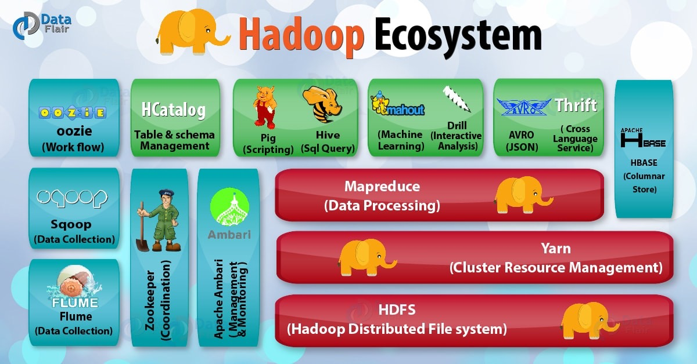
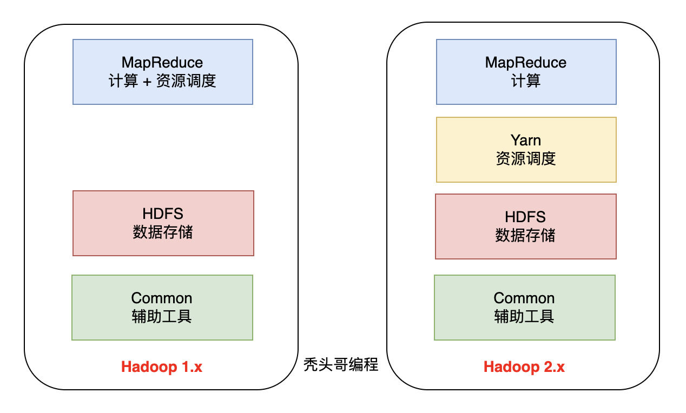
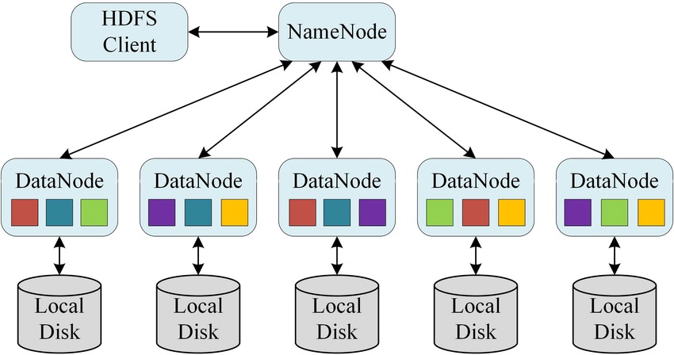
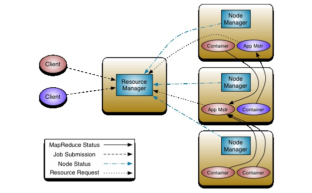
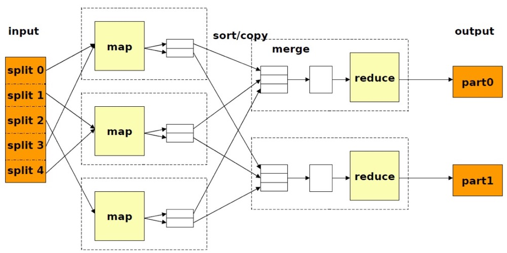
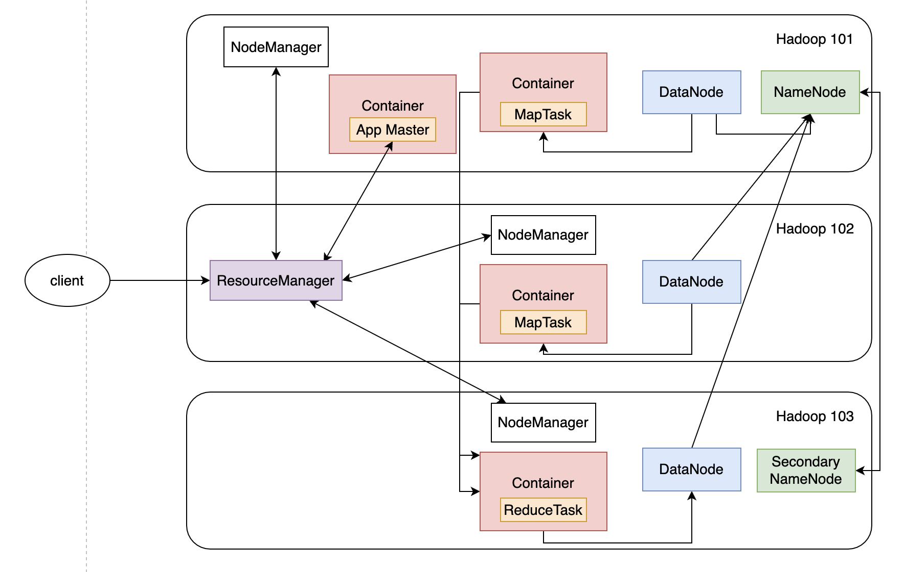
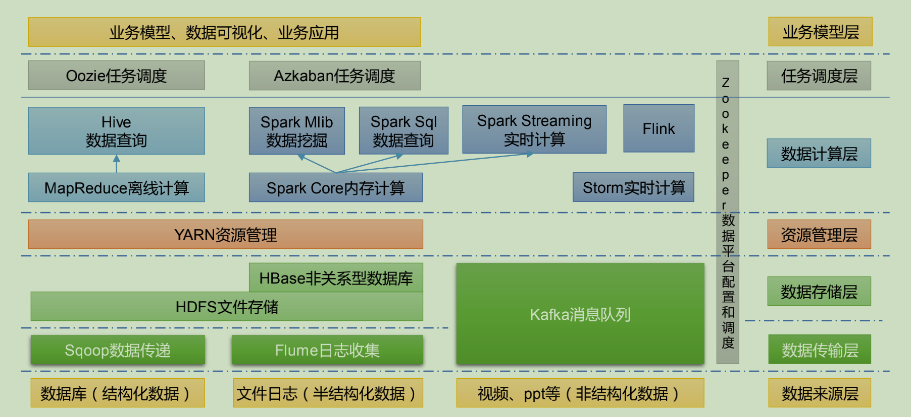
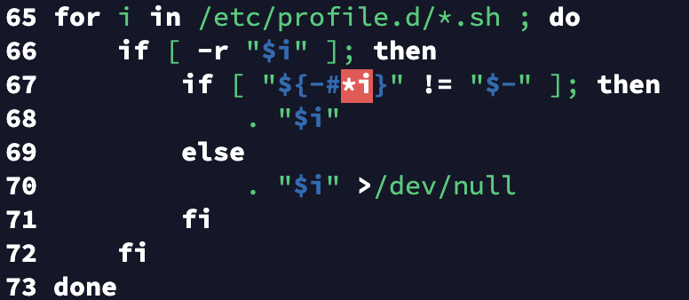
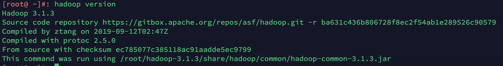

### 一、Hadoop概述

#### 1、Hadoop是什么

- Hadoop是一个由Apache基金会所开发的**分布式系统基础架构**。
- 主要解决海量数据的存储和海量数据的分析计算问题。
- 广义上来说，Hadoop通常是指Hadoop生态圈，包括HBase、HDFS、Zookeeper等框架。

根据官网的描述，Hadoop包含下面几个modules：

- **Hadoop Common**: The common utilities that support the other Hadoop modules.
- **Hadoop Distributed File System (HDFS™)**: A distributed file system that provides high-throughput access to application data.
- **Hadoop YARN**: A framework for job scheduling and cluster resource management.
- **Hadoop MapReduce**: A YARN-based system for parallel processing of large data sets.



#### 2、Hadoop发展历程

（1）Hadoop创始人Doug Cutting为了实现类似于Google的全文搜索功能，基于Lucene框架进行优化升级查询引擎和索引引擎。

（2）2001年年底Lucene成为Apache基金会的一个子项目。 

（3）对于海量数据的场景，Lucene框 架面 对与Google同样的困难，**存储海量数据困难，检索海量速度慢**。

（4）学习和模仿Google解决这些问题的办法 ：微型版Nutch。 

（5）Google在大数据方面的三篇论文，奠定了Hadoop的基础。**GFS --->HDFS**，**Map-Reduce --->MR**，**BigTable --->HBase**。

（6）2003-2004年，Google公开了部分GFS和MapReduce思想的细节，以此为基础Doug Cutting等人用

了2年业余时间实现了DFS和MapReduce机制，使Nutch性能飙升。

（7）2005 年Hadoop 作为 Lucene的子项目 Nutch的一部分正式引入Apache基金会。 

（8）2006 年 3 月份，Map-Reduce和Nutch Distributed File System （NDFS）分别被纳入到 Hadoop 项目

中，Hadoop就此正式诞生，标志着大数据时代来临。 

（9）名字来源于Doug Cutting儿子的玩具大象。

#### 3、Hadoop的三大发行版本

Hadoop 三大发行版本：Apache、Cloudera、Hortonworks。

- Apache 版本最原始（最基础）的版本，对于入门学习最好。2006

- Cloudera 内部集成了很多大数据框架，对应产品 CDH。2008

- Hortonworks 文档较好，对应产品 Hortonworks Data Platform（HDP）。2011

- Hortonworks 现在已经被 Cloudera 公司收购，推出新的品牌 CDP。

#### 4、Hadoop的优势

##### 4.1 高可靠性

底层维护多个数据副本，所以即使Hadoop某个计算元素或存储出现故障，也不会导致数据丢失。

##### 4.2 高扩展性

在集群间分配任务数据，可方便的扩展数以千计的节点。

##### 4.3 高效性

在MapReduce的思想下，Hadoop是并行工作的，以加快任务处理速度。

##### 4.4 高容错性

能够自动将失败的任务重新分配。

#### 5、Hadoop的组成

##### 5.1 Hadoop1.x 2.x 3.x的区别

在Hadoop1.x时，MapReduce同时处理业务逻辑运算和资源的调度，耦合性较大。

在Hadoop2.x时代，增加了Yarn，Yarn负责资源的调度，MapReduce负责运算。

Hadoop3.x在组成上没有变化。



##### 5.2 HDFS概述

Hadoop Distributed File System，分布式文件系统，简称HDFS。几个主要的概念如下：

（1）**NameNode**：存储文件的元数据。如文件名、文件目录结构、文件属性（生存时间、副本数、文件权限），以及每个文件的块列表和块所在的DataNode等。

（2）**DataNode**：在本地文件系统存储文件块数据，以及块数据的校验和。

（3）**Secondary NameNode**：每隔一定时间对NameNode元数据进行备份。



##### 5.3 Yarn概述

Yet Another Resource Negotiator简称Yarn，是一种资源协调者，是Hadoop的**资源管理器**。几个主要的概念如下：

（1）**ResourceManager**：管理整个集群的资源（CPU、内存等）

（2）**NodeManager**：管理单个节点服务器资源。

（3）**ApplicationMaster**：运行单个任务。

（4）**Container**：容器，相当于一台独立的服务器，里面封装了任务所需要的资源，比如CPU、内存、网络等。



注意：

（1）client可以有多个。

（2）集群上可以运行很多个ApplicationMaster。

（3）每个NodeManager可以有多个Container。

##### 5.4 MapReduce概述

MapReduce将计算过程分为两个阶段：Map和Reduce。

- Map阶段并行处理输入数据。
- Reduce阶段对Map结果进行汇总。



##### 5.5 HDFS、YARN和MR的关系



##### 5.6 大数据技术生态体系



（1）**Sqoop**：Sqoop 是一款开源的工具，主要用于在 Hadoop、Hive 与传统的数据库（MySQL）间进行数据的传递，可以将一个关系型数据库（例如 ：MySQL，Oracle 等）中的数据导进到 Hadoop 的 HDFS 中，也可以将 HDFS 的数据导进到关系型数据库中。

（2）**Flume**：Flume 是一个高可用的，高可靠的，分布式的海量日志采集、聚合和传输的系统，Flume 支持在日志系统中定制各类数据发送方，用于收集数据；

（3）**Kafka**：Kafka 是一种高吞吐量的分布式发布订阅消息系统；

（4）**Spark**：Spark 是当前最流行的开源大数据**内存计算**框架。可以基于 Hadoop 上存储的大数据进行计算。

（5）**Flink**：Flink 是当前最流行的开源大数据内存计算框架。用于实时计算的场景较多。

（6）**Oozie**：Oozie 是一个管理 Hadoop 作业（job）的工作流程调度管理系统。

（7）**HBase**：HBase 是一个分布式的、面向列的开源数据库。HBase 不同于一般的关系数据库，它是一个适合于非结构化数据存储的数据库。

（8）**Hive**：Hive 是基于 Hadoop 的一个数据仓库工具，可以将结构化的数据文件映射为一张数据库表，并提供简单的 SQL 查询功能，可以将 SQL 语句转换为 MapReduce 任务进行运行。其优点是学习成本低，可以通过类 SQL 语句快速实现简单的 MapReduce 统计，不必开发专门的 MapReduce 应用，十分适合数据仓库的统计分析。

（9）**Zookeeper**：它是一个针对大型分布式系统的可靠协调系统，提供的功能包括：配置维护、名字服务、分布式同步、组服务等。

### 二、搭建Hadoop集群

可以使用docker安装centos镜像，然后在centos中安装hadoop集群。操作系统为MacOS。

#### 1、创建基础centos镜像

```shell
# 下载centos7,docker pull centos:centos7 --platform=linux/amd64
docker pull centos:centos7
# 创建一个基础容器base-centos并启动, --platform指定运行的平台，不然会报错could not open '/lib64/ld-linux-x86-64.so.2': no such file or directory
docker run -d --name base-centos --platform linux/amd64 --privileged=true centos:centos7 /usr/sbin/init
# 进入容器
docker exec -it base-centos /bin/bash
# 安装wget
yum -y install wget
# 安装常用软件
yum install -y rsync openssh-server vim* lrzsz gcc-c++ pcre pcre-devel zlib zlib-devel ruby openssl openssl-devel patch bash-completion zlib.i686 libstdc++.i686 lsof unzip zip initscripts openssh-clients net-tools.x86_64 telnet* firewalld

# 修改sshd_config为密码登录
vim /etc/ssh/sshd_config
Port 22
PermitRootLogin yes

# 设置root密码，我这里设置为1311664842
passwd root

# 新建软件包存放目录和软件安装目录
mkdir -p /root/tools
mkdir -p /root/servers

# 把本地准备好的jdk和hadoop安装包上传到centos镜像
# docker cp 本地文件路径 镜像ID:镜像内文件路径
docker cp /Users/lxp/Documents/jdk-8u212-linux-x64.tar.gz d0fb52eec01f:/root/tools
docker cp /Users/lxp/Documents/hadoop-3.1.3.tar.gz d0fb52eec01f:/root/servers

# 解压jdk
tar -zxvf jdk-8u212-linux-x64.tar.gz -C /root/
# 配置环境变量
vi /etc/profile.d/my_env.sh
export JAVA_HOME=/root/jdk1.8.0_212
export PATH=$PATH:$JAVA_HOME/bin

source /etc/profile

# 查看java版本
java -version

# 创建自己的基础版centos
docker commit -a "lxp" -m "base centos" a17823d58f51 base-centos:v1
```

#### 2、用基础镜像创建3台服务器

```shell
# 构建集群子网
docker network create --subnet=172.18.0.0/16 hadoop-group

# 以base-centos启动三个容器
docker run -d --platform linux/amd64 --privileged=true -it --name hadoop1 -h hadoop1 --net hadoop-group --ip 172.18.0.2 -P -p 50070:50070 -p 19888:19888 base-centos:v1 /usr/sbin/init

docker run -d --platform linux/amd64 --privileged=true -it --name hadoop2 -h hadoop2 --net hadoop-group --ip 172.18.0.3 -P base-centos:v1 /usr/sbin/init

docker run -d --platform linux/amd64 --privileged=true -it --name hadoop3 -h hadoop3 --net hadoop-group --ip 172.18.0.4 -P -p 8088:8088 base-centos:v1 /usr/sbin/init

# 进入hadoop1
docker exec -it hadoop1 /bin/bash
# 1. 修改dns
vim /etc/resolv.conf
nameserver 114.114.114.114
# 2. 设置ssh登录自动添加kown_hosts
vim /etc/ssh/ssh_config
StrictHostKeyChecking no
# 3. 重启sshd
systemctl restart sshd
# hadoop2、hadoop3重复1、2、3步骤

# 配置主机名，方便后面同步，3台服务器都要配置
vim /etc/hosts
172.18.0.2	hadoop1
172.18.0.3	hadoop2
172.18.0.4	hadoop3
# 配置ssh key
ssh-keygen -t rsa
cat ~/.ssh/id_rsa.pub > ~/.ssh/authorized_keys
```

### 三、安装hadoop

hadoop需要java环境，所以需要先安装jdk。安装完jdk后再安装hadoop，之间解压即可。

解压完成后，配置环境变量。在`/etc/profile`文件中，有这么一段



它会循环遍历`/etc/profile.d/*.sh`文件，然后配置环境变量。所以我们在该目录下新增一个my_env.sh文件，自定义的环境变量都配置在该文件中。

```shell
export JAVA_HOME=/root/jdk1.8.0_212
export PATH=$PATH:$JAVA_HOME/bin

export HADOOP_HOME=/root/hadoop-3.1.3
export PATH=$PATH:$HADOOP_HOME/bin
export PATH=$PATH:$HADOOP_HOME/sbin
```

执行`source /etc/profile`让环境变量生效。输入`hadoop version`验证



### 四、Hadoop运行模式

根据官网，hadoop有三种运行模式，分别是本地模式，伪分布式模式，完全分布式模式。

- [Local (Standalone) Mode](https://hadoop.apache.org/docs/stable/hadoop-project-dist/hadoop-common/SingleCluster.html#Standalone_Operation)
- [Pseudo-Distributed Mode](https://hadoop.apache.org/docs/stable/hadoop-project-dist/hadoop-common/SingleCluster.html#Pseudo-Distributed_Operation)
- [Fully-Distributed Mode](https://hadoop.apache.org/docs/stable/hadoop-project-dist/hadoop-common/SingleCluster.html#Fully-Distributed_Operation)

本地模式：单台机器，数据存储在Linux本地，一般debug的时候会用。

伪分布式模式：单台机器，数据存储在HDFS，具备hadoop集群的所有功能，一台服务器模拟一个分布式环境。

完全分布式模式：多台服务器组成分布式环境。

#### 1、本地模式

运行wordcount程序

```shell
[root@ ~]#: cd hadoop-3.1.3/
[root@ hadoop-3.1.3]#: mkdir wc-input
[root@ hadoop-3.1.3]#: cd wc-input/
[root@ wc-input]#: vi word.txt

[root@ hadoop-3.1.3]#: bin/hadoop jar share/hadoop/mapreduce/hadoop-mapreduce-examples-3.1.3.jar wordcount wc-input/ ./wc-output
2022-05-14 14:36:25,230 INFO impl.MetricsConfig: loaded properties from hadoop-metrics2.properties
2022-05-14 14:36:25,465 INFO impl.MetricsSystemImpl: Scheduled Metric snapshot period at 10 second(s).
2022-05-14 14:36:25,466 INFO impl.MetricsSystemImpl: JobTracker metrics system started
2022-05-14 14:36:26,193 INFO input.FileInputFormat: Total input files to process : 1
2022-05-14 14:36:26,246 INFO mapreduce.JobSubmitter: number of splits:1
2022-05-14 14:36:26,603 INFO mapreduce.JobSubmitter: Submitting tokens for job: job_local1551967065_0001
2022-05-14 14:36:26,604 INFO mapreduce.JobSubmitter: Executing with tokens: []
2022-05-14 14:36:26,858 INFO mapreduce.Job: The url to track the job: http://localhost:8080/
2022-05-14 14:36:26,859 INFO mapreduce.Job: Running job: job_local1551967065_0001
2022-05-14 14:36:26,864 INFO mapred.LocalJobRunner: OutputCommitter set in config null
2022-05-14 14:36:26,880 INFO output.FileOutputCommitter: File Output Committer Algorithm version is 2
2022-05-14 14:36:26,880 INFO output.FileOutputCommitter: FileOutputCommitter skip cleanup _temporary folders under output directory:false, ignore cleanup failures: false
2022-05-14 14:36:26,881 INFO mapred.LocalJobRunner: OutputCommitter is org.apache.hadoop.mapreduce.lib.output.FileOutputCommitter
2022-05-14 14:36:26,950 INFO mapred.LocalJobRunner: Waiting for map tasks
2022-05-14 14:36:26,951 INFO mapred.LocalJobRunner: Starting task: attempt_local1551967065_0001_m_000000_0
2022-05-14 14:36:26,992 INFO output.FileOutputCommitter: File Output Committer Algorithm version is 2
2022-05-14 14:36:26,993 INFO output.FileOutputCommitter: FileOutputCommitter skip cleanup _temporary folders under output directory:false, ignore cleanup failures: false
2022-05-14 14:36:27,044 INFO mapred.Task:  Using ResourceCalculatorProcessTree : [ ]
2022-05-14 14:36:27,053 INFO mapred.MapTask: Processing split: file:/root/hadoop-3.1.3/wc-input/word.txt:0+59
2022-05-14 14:36:27,201 INFO mapred.MapTask: (EQUATOR) 0 kvi 26214396(104857584)
2022-05-14 14:36:27,201 INFO mapred.MapTask: mapreduce.task.io.sort.mb: 100
2022-05-14 14:36:27,201 INFO mapred.MapTask: soft limit at 83886080
2022-05-14 14:36:27,201 INFO mapred.MapTask: bufstart = 0; bufvoid = 104857600
2022-05-14 14:36:27,201 INFO mapred.MapTask: kvstart = 26214396; length = 6553600
2022-05-14 14:36:27,210 INFO mapred.MapTask: Map output collector class = org.apache.hadoop.mapred.MapTask$MapOutputBuffer
2022-05-14 14:36:27,222 INFO mapred.LocalJobRunner: 
2022-05-14 14:36:27,222 INFO mapred.MapTask: Starting flush of map output
2022-05-14 14:36:27,222 INFO mapred.MapTask: Spilling map output
2022-05-14 14:36:27,222 INFO mapred.MapTask: bufstart = 0; bufend = 115; bufvoid = 104857600
2022-05-14 14:36:27,222 INFO mapred.MapTask: kvstart = 26214396(104857584); kvend = 26214344(104857376); length = 53/6553600
2022-05-14 14:36:27,243 INFO mapred.MapTask: Finished spill 0
2022-05-14 14:36:27,268 INFO mapred.Task: Task:attempt_local1551967065_0001_m_000000_0 is done. And is in the process of committing
2022-05-14 14:36:27,270 INFO mapred.LocalJobRunner: map
2022-05-14 14:36:27,270 INFO mapred.Task: Task 'attempt_local1551967065_0001_m_000000_0' done.
2022-05-14 14:36:27,283 INFO mapred.Task: Final Counters for attempt_local1551967065_0001_m_000000_0: Counters: 18
        File System Counters
                FILE: Number of bytes read=316601
                FILE: Number of bytes written=819496
                FILE: Number of read operations=0
                FILE: Number of large read operations=0
                FILE: Number of write operations=0
        Map-Reduce Framework
                Map input records=5
                Map output records=14
                Map output bytes=115
                Map output materialized bytes=131
                Input split bytes=106
                Combine input records=14
                Combine output records=12
                Spilled Records=12
                Failed Shuffles=0
                Merged Map outputs=0
                GC time elapsed (ms)=29
                Total committed heap usage (bytes)=135335936
        File Input Format Counters 
                Bytes Read=59
2022-05-14 14:36:27,283 INFO mapred.LocalJobRunner: Finishing task: attempt_local1551967065_0001_m_000000_0
2022-05-14 14:36:27,284 INFO mapred.LocalJobRunner: map task executor complete.
2022-05-14 14:36:27,289 INFO mapred.LocalJobRunner: Waiting for reduce tasks
2022-05-14 14:36:27,290 INFO mapred.LocalJobRunner: Starting task: attempt_local1551967065_0001_r_000000_0
2022-05-14 14:36:27,313 INFO output.FileOutputCommitter: File Output Committer Algorithm version is 2
2022-05-14 14:36:27,313 INFO output.FileOutputCommitter: FileOutputCommitter skip cleanup _temporary folders under output directory:false, ignore cleanup failures: false
2022-05-14 14:36:27,313 INFO mapred.Task:  Using ResourceCalculatorProcessTree : [ ]
2022-05-14 14:36:27,316 INFO mapred.ReduceTask: Using ShuffleConsumerPlugin: org.apache.hadoop.mapreduce.task.reduce.Shuffle@35be4ac3
2022-05-14 14:36:27,329 WARN impl.MetricsSystemImpl: JobTracker metrics system already initialized!
2022-05-14 14:36:27,347 INFO reduce.MergeManagerImpl: MergerManager: memoryLimit=326402048, maxSingleShuffleLimit=81600512, mergeThreshold=215425360, ioSortFactor=10, memToMemMergeOutputsThreshold=10
2022-05-14 14:36:27,361 INFO reduce.EventFetcher: attempt_local1551967065_0001_r_000000_0 Thread started: EventFetcher for fetching Map Completion Events
2022-05-14 14:36:27,400 INFO reduce.LocalFetcher: localfetcher#1 about to shuffle output of map attempt_local1551967065_0001_m_000000_0 decomp: 127 len: 131 to MEMORY
2022-05-14 14:36:27,419 INFO reduce.InMemoryMapOutput: Read 127 bytes from map-output for attempt_local1551967065_0001_m_000000_0
2022-05-14 14:36:27,421 INFO reduce.MergeManagerImpl: closeInMemoryFile -> map-output of size: 127, inMemoryMapOutputs.size() -> 1, commitMemory -> 0, usedMemory ->127
2022-05-14 14:36:27,425 INFO reduce.EventFetcher: EventFetcher is interrupted.. Returning
2022-05-14 14:36:27,426 INFO mapred.LocalJobRunner: 1 / 1 copied.
2022-05-14 14:36:27,427 INFO reduce.MergeManagerImpl: finalMerge called with 1 in-memory map-outputs and 0 on-disk map-outputs
2022-05-14 14:36:27,432 INFO mapred.Merger: Merging 1 sorted segments
2022-05-14 14:36:27,432 INFO mapred.Merger: Down to the last merge-pass, with 1 segments left of total size: 121 bytes
2022-05-14 14:36:27,438 INFO reduce.MergeManagerImpl: Merged 1 segments, 127 bytes to disk to satisfy reduce memory limit
2022-05-14 14:36:27,439 INFO reduce.MergeManagerImpl: Merging 1 files, 131 bytes from disk
2022-05-14 14:36:27,439 INFO reduce.MergeManagerImpl: Merging 0 segments, 0 bytes from memory into reduce
2022-05-14 14:36:27,439 INFO mapred.Merger: Merging 1 sorted segments
2022-05-14 14:36:27,442 INFO mapred.Merger: Down to the last merge-pass, with 1 segments left of total size: 121 bytes
2022-05-14 14:36:27,442 INFO mapred.LocalJobRunner: 1 / 1 copied.
2022-05-14 14:36:27,449 WARN io.ReadaheadPool: Failed readahead on ifile
EBADF: Bad file descriptor
        at org.apache.hadoop.io.nativeio.NativeIO$POSIX.posix_fadvise(Native Method)
        at org.apache.hadoop.io.nativeio.NativeIO$POSIX.posixFadviseIfPossible(NativeIO.java:270)
        at org.apache.hadoop.io.nativeio.NativeIO$POSIX$CacheManipulator.posixFadviseIfPossible(NativeIO.java:147)
        at org.apache.hadoop.io.ReadaheadPool$ReadaheadRequestImpl.run(ReadaheadPool.java:208)
        at java.util.concurrent.ThreadPoolExecutor.runWorker(ThreadPoolExecutor.java:1149)
        at java.util.concurrent.ThreadPoolExecutor$Worker.run(ThreadPoolExecutor.java:624)
        at java.lang.Thread.run(Thread.java:748)
2022-05-14 14:36:27,454 INFO Configuration.deprecation: mapred.skip.on is deprecated. Instead, use mapreduce.job.skiprecords
2022-05-14 14:36:27,456 INFO mapred.Task: Task:attempt_local1551967065_0001_r_000000_0 is done. And is in the process of committing
2022-05-14 14:36:27,457 INFO mapred.LocalJobRunner: 1 / 1 copied.
2022-05-14 14:36:27,457 INFO mapred.Task: Task attempt_local1551967065_0001_r_000000_0 is allowed to commit now
2022-05-14 14:36:27,464 INFO output.FileOutputCommitter: Saved output of task 'attempt_local1551967065_0001_r_000000_0' to file:/root/hadoop-3.1.3/wc-output
2022-05-14 14:36:27,466 INFO mapred.LocalJobRunner: reduce > reduce
2022-05-14 14:36:27,466 INFO mapred.Task: Task 'attempt_local1551967065_0001_r_000000_0' done.
2022-05-14 14:36:27,466 INFO mapred.Task: Final Counters for attempt_local1551967065_0001_r_000000_0: Counters: 24
        File System Counters
                FILE: Number of bytes read=316895
                FILE: Number of bytes written=819716
                FILE: Number of read operations=0
                FILE: Number of large read operations=0
                FILE: Number of write operations=0
        Map-Reduce Framework
                Combine input records=0
                Combine output records=0
                Reduce input groups=12
                Reduce shuffle bytes=131
                Reduce input records=12
                Reduce output records=12
                Spilled Records=12
                Shuffled Maps =1
                Failed Shuffles=0
                Merged Map outputs=1
                GC time elapsed (ms)=3
                Total committed heap usage (bytes)=135335936
        Shuffle Errors
                BAD_ID=0
                CONNECTION=0
                IO_ERROR=0
                WRONG_LENGTH=0
                WRONG_MAP=0
                WRONG_REDUCE=0
        File Output Format Counters 
                Bytes Written=89
2022-05-14 14:36:27,466 INFO mapred.LocalJobRunner: Finishing task: attempt_local1551967065_0001_r_000000_0
2022-05-14 14:36:27,472 INFO mapred.LocalJobRunner: reduce task executor complete.
2022-05-14 14:36:27,863 INFO mapreduce.Job: Job job_local1551967065_0001 running in uber mode : false
2022-05-14 14:36:27,867 INFO mapreduce.Job:  map 100% reduce 100%
2022-05-14 14:36:27,868 INFO mapreduce.Job: Job job_local1551967065_0001 completed successfully
2022-05-14 14:36:27,884 INFO mapreduce.Job: Counters: 30
        File System Counters
                FILE: Number of bytes read=633496
                FILE: Number of bytes written=1639212
                FILE: Number of read operations=0
                FILE: Number of large read operations=0
                FILE: Number of write operations=0
        Map-Reduce Framework
                Map input records=5
                Map output records=14
                Map output bytes=115
                Map output materialized bytes=131
                Input split bytes=106
                Combine input records=14
                Combine output records=12
                Reduce input groups=12
                Reduce shuffle bytes=131
                Reduce input records=12
                Reduce output records=12
                Spilled Records=24
                Shuffled Maps =1
                Failed Shuffles=0
                Merged Map outputs=1
                GC time elapsed (ms)=32
                Total committed heap usage (bytes)=270671872
        Shuffle Errors
                BAD_ID=0
                CONNECTION=0
                IO_ERROR=0
                WRONG_LENGTH=0
                WRONG_MAP=0
                WRONG_REDUCE=0
        File Input Format Counters 
                Bytes Read=59
        File Output Format Counters 
                Bytes Written=89
                
[root@ hadoop-3.1.3]#: cat wc-output/
part-r-00000       .part-r-00000.crc  _SUCCESS           ._SUCCESS.crc      
[root@ hadoop-3.1.3]#: cat wc-output/part-r-00000 
Let     1
china   1
china?  1
go      1
goods   1
haha    1
hi      1
is      3
like    1
me      1
to      1
you?    1
[root@ hadoop-3.1.3]#: cat wc-input/word.txt 
china is goods
is me like you?
hi
Let is go to china?
haha

# 再次运行报错，输出路径已存在
[root@ hadoop-3.1.3]#: bin/hadoop jar share/hadoop/mapreduce/hadoop-mapreduce-examples-3.1.3.jar wordcount wc-input/ ./wc-output
2022-05-14 14:38:45,964 INFO impl.MetricsConfig: loaded properties from hadoop-metrics2.properties
2022-05-14 14:38:46,114 INFO impl.MetricsSystemImpl: Scheduled Metric snapshot period at 10 second(s).
2022-05-14 14:38:46,114 INFO impl.MetricsSystemImpl: JobTracker metrics system started
org.apache.hadoop.mapred.FileAlreadyExistsException: Output directory file:/root/hadoop-3.1.3/wc-output already exists
        at org.apache.hadoop.mapreduce.lib.output.FileOutputFormat.checkOutputSpecs(FileOutputFormat.java:164)
        at org.apache.hadoop.mapreduce.JobSubmitter.checkSpecs(JobSubmitter.java:277)
        at org.apache.hadoop.mapreduce.JobSubmitter.submitJobInternal(JobSubmitter.java:143)
        at org.apache.hadoop.mapreduce.Job$11.run(Job.java:1570)
        at org.apache.hadoop.mapreduce.Job$11.run(Job.java:1567)
        at java.security.AccessController.doPrivileged(Native Method)
        at javax.security.auth.Subject.doAs(Subject.java:422)
        at org.apache.hadoop.security.UserGroupInformation.doAs(UserGroupInformation.java:1729)
        at org.apache.hadoop.mapreduce.Job.submit(Job.java:1567)
        at org.apache.hadoop.mapreduce.Job.waitForCompletion(Job.java:1588)
        at org.apache.hadoop.examples.WordCount.main(WordCount.java:87)
        at sun.reflect.NativeMethodAccessorImpl.invoke0(Native Method)
        at sun.reflect.NativeMethodAccessorImpl.invoke(NativeMethodAccessorImpl.java:62)
        at sun.reflect.DelegatingMethodAccessorImpl.invoke(DelegatingMethodAccessorImpl.java:43)
        at java.lang.reflect.Method.invoke(Method.java:498)
        at org.apache.hadoop.util.ProgramDriver$ProgramDescription.invoke(ProgramDriver.java:71)
        at org.apache.hadoop.util.ProgramDriver.run(ProgramDriver.java:144)
        at org.apache.hadoop.examples.ExampleDriver.main(ExampleDriver.java:74)
        at sun.reflect.NativeMethodAccessorImpl.invoke0(Native Method)
        at sun.reflect.NativeMethodAccessorImpl.invoke(NativeMethodAccessorImpl.java:62)
        at sun.reflect.DelegatingMethodAccessorImpl.invoke(DelegatingMethodAccessorImpl.java:43)
        at java.lang.reflect.Method.invoke(Method.java:498)
        at org.apache.hadoop.util.RunJar.run(RunJar.java:318)
        at org.apache.hadoop.util.RunJar.main(RunJar.java:232)
```

