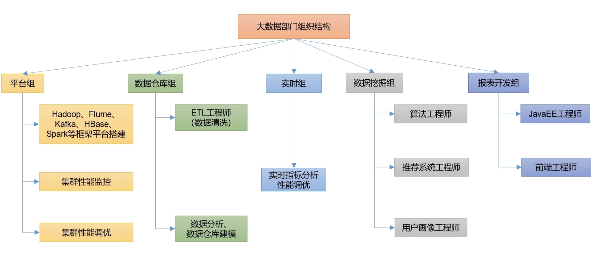

#### 1、大数据是做什么的

大数据（big data），指**无法在一定时间范围**内用常规软件工具进行捕捉、管理和处理的数据集合，是需要新处理模式才能具有更强的决策力、洞察发现力和流程优化能力的**海量、高增长率和多样化的信息资产**。

大数据主要解决**海量数据的采集、存储和分析计算**问题。

bit、Byte、KB、MB、GB、TB、PB、EB、ZB、YB、BB、NB、DB。一般大数据处理的都是TB以上级别的数据。

#### 2、大数据的特点

##### 2.1 Volume（大量）

处理海量数据。

##### 2.2 Velocity（高速）

大数据区分于传统数据挖掘的最明显特征。

##### 2.3 Variety（多样）

将数据分为结构化数据和非结构化数据。相对于之前方便存储的以数据库/文本为主的结构化数据，图片、语音、文件、地址位置等非结构化数据越来越多，这些多类型的数据对数据的处理能力提出了更高的要求。

##### 2.4 Value（低价值密度）

价值密度的高低与数据总量的大小成反比。如果快速对有价值数据“提纯”成为目前大数据背景下急需解决的问题。

#### 3、大数据的岗位划分

