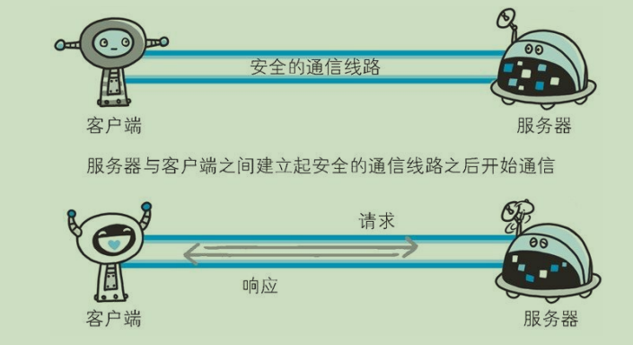
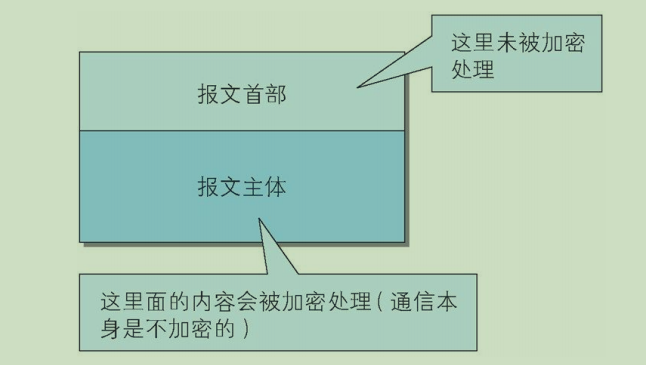
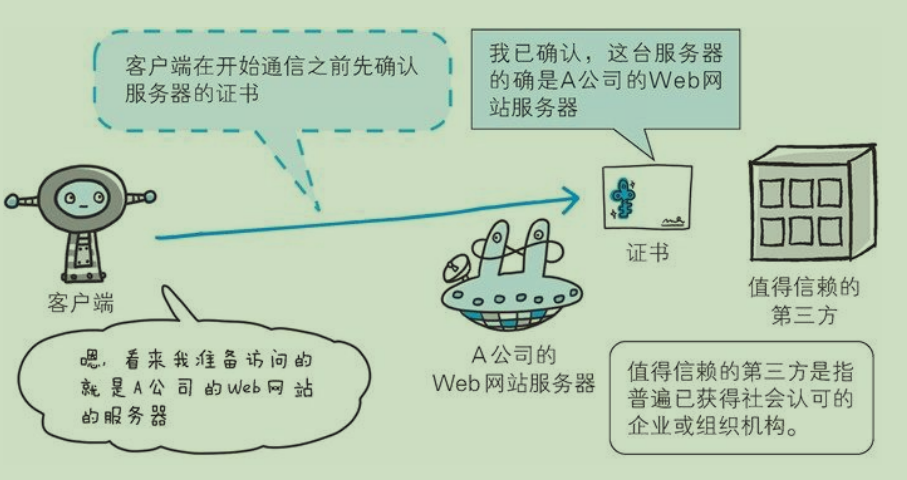
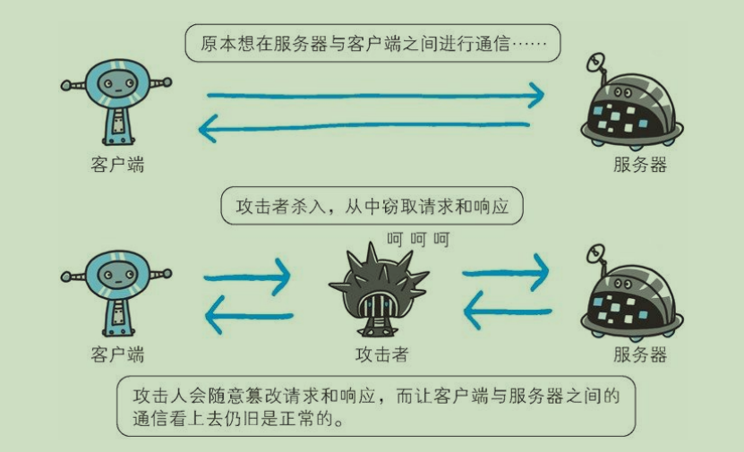
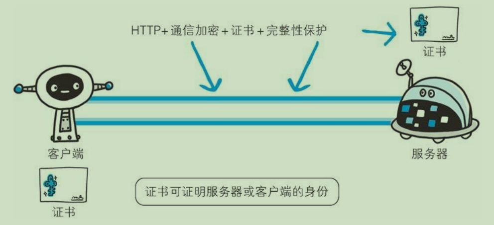
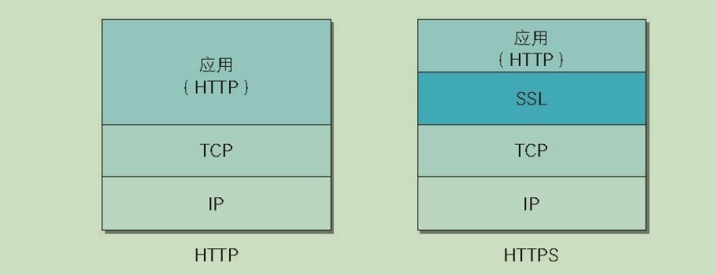
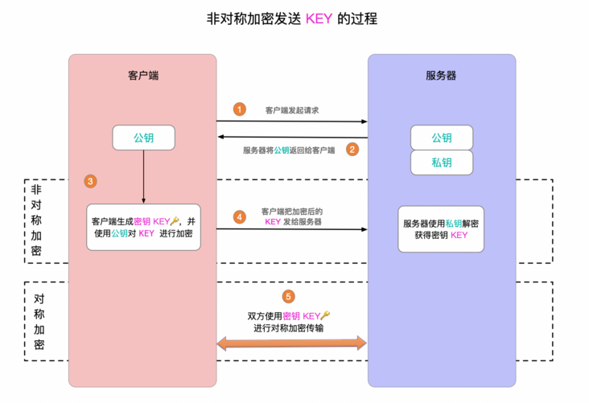
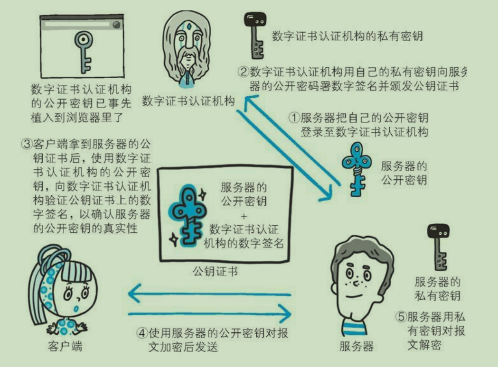
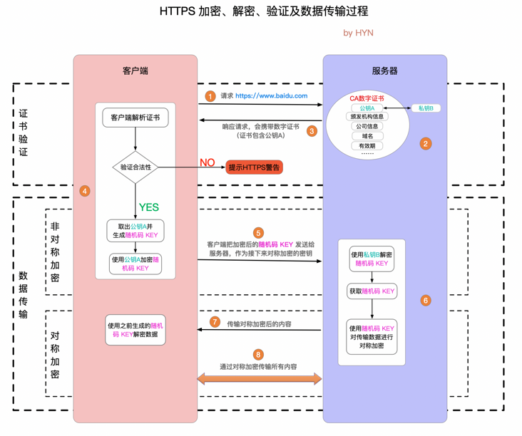

http协议可能存在信息窃听或身份伪造等安全问题，使用https通信机制可以有效的防止这些问题。

#### 1、HTTP的缺点

凡事皆有两面性，http作为应用广泛的通信协议，自然是十分优秀的，但其也存在不足之处：

（1）**通信使用明文，可能会被窃听。**

为了保证http传输的高效性，http本身不具备加密功能，所以无法对通信整体进行加密。为了解决这个问题，可以对通信或者内容进行加密。

**通信加密**：可以通过SSL（Secure Socket Layer，安全套接层）或TLS（Transport Layer Security，安全层传输协议）的组合使用，加密HTTP的通信内容。

用SSL建立安全通信线路之后，就可以在这条线路上进行HTTP通信了。**与SSL组合使用的HTTP就是HTTPS（HTTP Secure，超文本传输安全协议）**。

**内容加密**：由于 HTTP 协议中没有加密机制，那么就对 HTTP 协议传输的内容本身加密。即把HTTP 报文里所含的内容进行加密处理。 在这种情况下，客户端需要对 HTTP 报文进行加密处理后再发送请求。

为了做到有效的内容加密，前提是要求客户端和服务器同时具备加密和解密机制。主要应用在 Web 服务中。有一点必须引起注意，由于该方式不同于 SSL或 TLS 将整个通信线路加密处理，所以内容仍有被篡改的风险。

（2）**通信时不会验证双方的身份，可能遭遇伪装。**

在这种情况下， 任何客户端都可以发送请求，而服务器只要接收到请求，不管对方是谁都会返回一个响应。在这种机制下就可能存在很多问题。

为了解决这一问题，也可以使用SSL协议。SSL协议不仅能进行加密处理，而且还使用了证书可以用于确定对方的身份。证书由值得信任的第三方机构颁发，用以证明服务器和客户端是实际存在的。另外，伪造证书从技术角度来说是异常困难的一件事。所以只要能够确认通信方（服务器或客户端）持有的证书，即可判断通信方的真实意图。

（3）**无法证明报文的完整性，可能遭遇篡改。**

所谓完整性是指信息的准确度。若无法证明其完整性，通常也就意味着无法判断信息是否准确。 

由于HTTP无法验证报文的准确性，因此在请求或者响应时发送的报文数据，在接收到之前有可能会被篡改，但HTTP无法知悉。

比如，从某个 Web 网站上下载内容，是无法确定客户端下载的文件和服务器上存放的文件是否前后一致的。文件内容在传输途中可能已经被篡改为其他的内容。即使内容真的已改变，作为接收方的客户端也是觉察不到的。 

像这样，请求或响应在传输途中，遭攻击者拦截并篡改内容的攻击称为**中间人攻击**（Man-in-the-Middle attack，MITM）。 

虽然有HTTP协议确定报文完整性的方法，但事实上并不便捷可靠。其中常用的是MD5和SHA-1等散列值校验方法，以此用来确认文件的数字签名方法。

为了有效防止这些弊端，有必要使用 HTTPS。SSL提供认证和加密处理及摘要功能。仅靠 HTTP 确保完整性是非常困难的，因此通过和其他协议组合使用来实现这个目标。

#### 2、HTTPS

##### 2.1 HTTPS是什么

**HTTPS = HTTP + 加密 + 认证 + 完整性保护**。HTTP加上加密处理和认证以及完整性保护后即是HTTPS。

如果在HTTP协议通信过程中使用了未经加密的明文，比如在web页面中输入信用卡号，如果这条通信线路遭到窃听，那么信用卡号就暴露了。

另外对于HTTP来说，不管是客户端还是服务端，都没有办法确认通信双方。因为很有可能并不是和原本预想的通信方在实际通信。并且还需要考虑到接收到的报文在通信途中已经遭到篡改这一可能性。

为了统一解决上述这些问题，需要在 HTTP 上再加入加密处理和认证等机制。我们把添加了加密及认证机制的 HTTP 称为 HTTPS（HTTP Secure）。 

HTTPS并非是应用层的新协议，只是HTTP通信接口部分用SSL（Secure Socket Layer）和TLS（Transport Layer Security）协议代替。

通常，HTTP直接和TCP通信。当使用SSL时，则演变成先和SSL通信，再由SSL和TCP通信。简而言之，HTTPS就是身披SSL协议的HTTP。

采用SSL后，HTTP就拥有了HTTPS的加密、证书和完整性保护的功能。

SSL是独立于 HTTP 的协议，所以不光是 HTTP 协议，其他运行在应用层的 SMTP 和 Telnet 等协议均可配合 SSL协议使用。可以说 SSL是当今世界上应用最为广泛的网络安全技术。 

##### 2.2 加密技术

加密技术可以分为两类：对称加密和非对称加密。

（1）**对称加密**：密钥只有一个，加密解密为同⼀个密码，且加解密速度快，典型的对称加密算法有DES、AES等；

利用这种加密方式加密时必须要把密钥也发送给对方，密钥在传输过程中如果被截获，那么也就失去了加密的意义。

（2）**非对称加密**：：密钥成对出现（且根据公钥⽆法推知私钥，根据私钥也⽆法推知公钥），加密解密使⽤不同密钥（公钥加密需要私钥解密，私钥加密需要公钥解密），相对对称加密速度慢，典型的⾮对称加密算法有RSA、DSA等。

非对称加密很好的解决了对称加密的不足之处。非对称加密使用一对非对称的密钥。一把叫做私有密钥（private key），另一把叫做公开密钥（public key）。顾名思义，私有密钥不能让其他任何人知道，而公开密钥则可以随意发布，任何人都可以获得。

使用非对称加密方式，发送密文的一方使用对方的公开密钥进行加密处理，对方收到被加密的信息后，再使用自己的私有密钥进行解密。利用这种方式，不需要发送用来解密的私有密钥，也不必担心密钥被攻击者窃听而盗走。 

另外，要想根据密文和公开密钥，恢复到信息原文是异常困难的，因为解密过程就是在对离散对数进行求值，这并非轻而易举就能办到。退一步讲，如果能对一个非常大的整数做到快速地因式分解，那么密码破解还是存在希望的。但就目前的技术来看是不太现实的。 

##### 2.3 HTTPS的加密方式

HTTPS采用混合加密的方式，即同时采用了对称加密和非对称加密。

非对称加密虽然比对称加密更安全，但其不足之处就是加解密需要耗费更长的时间。所以HTTPS综合了两者的优势，**在交换密钥环节使用了非对称加密方式，之后建立通信交换报文阶段则使用了对称加密方式**。

在上述过程，客户端和服务器先使用非对称加密，服务器将公钥返回给客户端，客户端在拿到服务端的公钥后，通过公钥对key进行加密后发送给服务器，服务器再使用它的私钥进行解密后得到key。这个key只有服务器才能拿到。随后客户端和服务端建立连接进行通信，为了提高通信效率，使用对称加密进行，密钥就是之前拿到的key。

HTTPS 正好综合了这两种加密算法的优点，不仅保证了通信安全，还保证了数据传输效率。

##### 2.4 CA证书

遗憾的是，非对称加密方式还是存在一些问题的。那就是无法证明公开密钥本身就是货真价实的公开密钥。比如，正准备和某台服务器建立非对称加密方式下的通信时，如何证明收到的公开密钥就是原本预想的那台服务器发行的公开密钥。或许在公开密钥传输途中，真正的公开密钥已经被攻击者替换掉了。 

为了解决上述问题，可以使用由数字证书认证机构（CA，Certificate Authority）和其相关机关颁发的公开密钥证书。 

首先，服务器的运营人员向数字证书认证机构提出公开密钥的申请。数字证书认证机构在判明提出申请者的身份之后，会对已申请的公开密钥做数字签名，然后分配这个已签名的公开密钥，并将该公开密钥放入公钥证书后绑定在一起。

服务器会将这份由数字证书认证机构颁发的公钥证书发送给客户端，以进行公开密钥加密方式通信。公钥证书也可叫做数字证书或直接称为证书。 接到证书的客户端可使用数字证书认证机构的公开密钥，对那张证书上的数字签名进行验证，一旦验证通过，客户端便可明确两件事： 一，认证服务器的公开密钥的是真实有效的数字证书认证机构。二，服务器的公开密钥是值得信赖的。

此处认证机关的公开密钥必须安全地转交给客户端。使用通信方式时，如何安全转交是一件很困难的事，因此，多数浏览器开发商发布版本时，会事先在内部植入常用认证机关的公开密钥。 

##### 2.5 HTTPS的通信过程

大致分为三个过程：**证书验证、建立连接、数据传输**。

（1）客户端发送请求给服务器。

（2）服务器保存有CA证书，该证书中包含有非对称加密的公钥以及其他公司信息等。

（3）服务器响应请求，并且携带数字证书发送给客户端

（4）客户端接收到数字证书后，会进行解析，如果证书不是可信机构颁布，或者证书中的域名与实际域名不一致，或者证书已经过期，就会向访问者显示一个警告，由其选择是否还要继续通信。

如果证书没有问题，客户端就会从服务器证书中取出服务器的公钥A。然后客户端还会生成一个随机码 KEY，并使用公钥A将其加密。

（5）客户端把加密后的key发送给服务器。

（6）服务器会使用它独有的私钥B对加密后的key进行解密得到key。此时客户端和服务器建立连接，保证了key只有双方才知道，为后面通信时数据传输做准备。

（7）服务器使用密钥 (随机码 KEY)对数据进行对称加密并发送给客户端，客户端使用相同的密钥 (随机码 KEY)解密数据。

（8）双方使用对称加密愉快地传输所有数据。

#### 3、总结

HTTP和HTTPS的区别

- 最重要的区别就是安全性，HTTP 明文传输，不对数据进行加密安全性较差。HTTPS (HTTP + SSL / TLS)的数据传输过程是加密的，安全性较好。
- 使用 HTTPS 协议需要申请 CA 证书，一般免费证书较少，因而需要一定费用。证书颁发机构如：Symantec、Comodo、DigiCert 和 GlobalSign 等。
- HTTP 页面响应速度比 HTTPS 快，这个很好理解，由于加了一层安全层，建立连接的过程更复杂，也要交换更多的数据，难免影响速度。
- 由于 HTTPS 是建构在 SSL / TLS 之上的 HTTP 协议，所以，要比 HTTP 更耗费服务器资源。
- HTTPS 和 HTTP 使用的是完全不同的连接方式，用的端口也不一样，前者是 443，后者是 80。

HTTPS 缺点

- 在相同网络环境中，HTTPS 相比 HTTP 无论是响应时间还是耗电量都有大幅度上升。
- HTTPS 的安全是有范围的，在黑客攻击、服务器劫持等情况下几乎起不到作用。
- 在现有的证书机制下，中间人攻击依然有可能发生。
- HTTPS 需要更多的服务器资源，也会导致成本的升高。